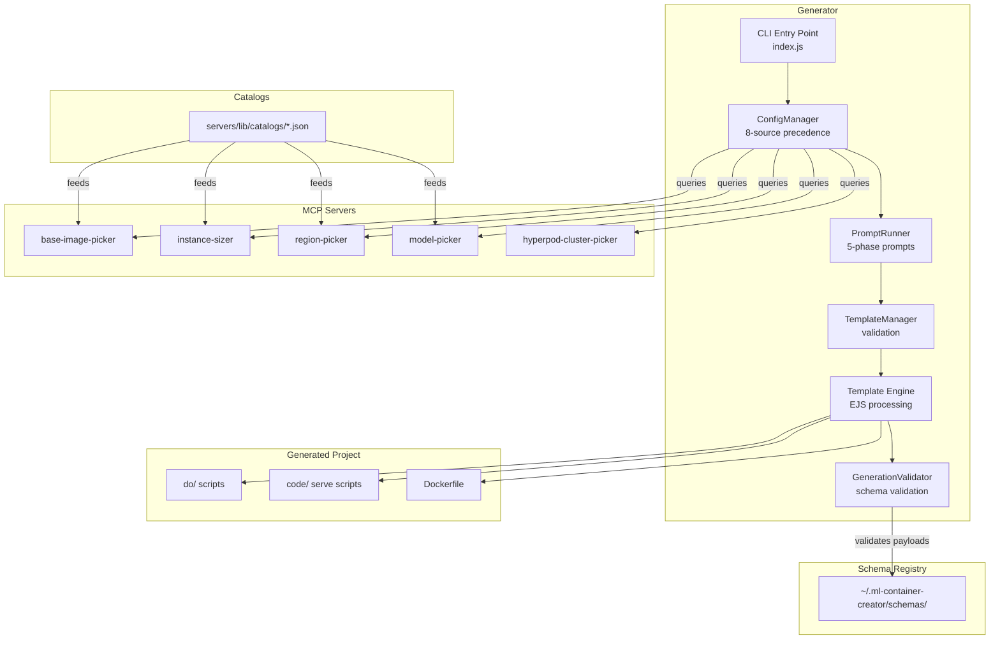

# Architecture Overview

This page provides a high-level overview of the ML Container Creator system. For detailed implementation guidance, see the [Generator Architecture](dev/generator-architecture.md) developer guide.

## System Components



## Deployment Configurations

The generator supports 15 deployment configurations across 4 architecture families:

| Architecture | Backends | Description |
|---|---|---|
| HTTP | flask, fastapi | Traditional ML models (sklearn, xgboost, tensorflow) with a Python web server |
| Transformers | vllm, sglang, tensorrt-llm, lmi, djl | LLM serving where the framework handles HTTP, batching, and model loading |
| Triton | fil, onnxruntime, tensorflow, pytorch, vllm, tensorrtllm, python | NVIDIA Triton Inference Server with model repository pattern |
| Diffusors | vllm-omni | Image generation models via vLLM's diffusion support |

Each configuration is expressed as an `architecture-backend` string (e.g., `transformers-vllm`, `triton-fil`).

## Deployment Targets

| Target | Description |
|---|---|
| `managed-inference` | Real-time SageMaker AI endpoints |
| `async-inference` | Asynchronous endpoints with S3 input/output |
| `batch-transform` | Batch processing of datasets in S3 |
| `hyperpod-eks` | Kubernetes deployment on SageMaker AI HyperPod EKS clusters |

## Generator Lifecycle

The CLI runs through four generation phases:

1. **Initializing** — Loads configuration from CLI, environment, config files, and MCP servers. Checks for subcommands (bootstrap, registry, mcp).
2. **Prompting** — Collects user input in four phases: Infrastructure, Core ML, Modules, Project. Queries MCP servers for instance types, regions, base images, and models.
3. **Writing** — Validates the configuration, processes EJS templates, and generates the project with do-framework scripts.
4. **Post-generate** — Runs sample model training if requested, sets executable permissions.

## Generated Project Structure

Every generated project uses the [do-framework](https://github.com/iankoulski/do-framework) for lifecycle management:

```
project-name/
├── Dockerfile
├── do/
│   ├── config              # All configuration variables
│   ├── build               # Build Docker image
│   ├── push                # Push to ECR
│   ├── submit              # Submit to CodeBuild
│   ├── deploy              # Deploy to SageMaker AI
│   ├── test                # Run inference tests
│   ├── clean               # Tear down resources
│   ├── register            # Log to deployment registry
│   ├── export              # Export config as JSON
│   ├── manifest            # Asset manifest operations
│   ├── logs                # View CloudWatch logs
│   ├── ci                  # CI harness commands
│   └── run                 # Run container locally
├── code/
│   └── serve               # Model serving entrypoint
├── model_repository/       # Triton only
└── sample_model/           # Optional
```

## CLI Subcommands

Beyond project generation, the CLI provides:

| Subcommand | Purpose |
|---|---|
| `bootstrap` | One-time AWS infrastructure setup (IAM role, ECR, S3, CI stack) with named profiles |
| `bootstrap status` | Show provisioned resources and detect drift |
| `registry log` | Record a deployment to the local registry |
| `registry list` | List past deployments |
| `mcp` | Query configured MCP servers directly |

## MCP Server Ecosystem

Five bundled MCP servers provide dynamic configuration data:

| Server | Catalogs | Purpose |
|---|---|---|
| `base-image-picker` | Base images per backend | Curated, versioned container images |
| `instance-recommender` | Instance types with GPU specs | Instance selection with accelerator metadata |
| `region-picker` | Service availability per region | Region filtering by service support |
| `model-picker` | HuggingFace, JumpStart, S3, Registry | Model discovery and metadata resolution |
| `hyperpod-cluster-picker` | Live cluster discovery | Finds existing HyperPod EKS clusters |

All servers support two modes: **static** (reads from JSON catalogs) and **smart** (queries live AWS APIs or Bedrock for reasoning).

## Configuration Precedence

The ConfigManager merges values from 8 sources (highest precedence first):

1. CLI options (`--deployment-config`, `--instance-type`, etc.)
2. CLI arguments (positional)
3. Environment variables (`ML_DEPLOYMENT_CONFIG`, etc.)
4. CLI config file (`--config path.json`)
5. Custom config file (`config/mcp.json`)
6. `package.json` section
7. MCP server responses
8. Generator defaults

## Supporting Infrastructure

| Component | Purpose |
|---|---|
| **Bootstrap profiles** | Named AWS configurations at `~/.ml-container-creator/config.json` |
| **Deployment registry** | Per-profile asset manifest tracking deployed resources |
| **CI Integration Harness** | Automated end-to-end testing of all 15 deployment configs (see [CI Integration](ci-integration.md)) |
| **Validation engine** | Accelerator compatibility checks (CUDA, Neuron, ROCm, CPU) |

## Further Reading

- [Generator Architecture](dev/generator-architecture.md) — Detailed module-by-module walkthrough
- [Template System](dev/template-system.md) — EJS templates, do/ script branching, Dockerfile conditionals
- [MCP Server Development](dev/mcp-server-development.md) — Adding catalog entries, creating new servers
- [Registries and Catalogs](dev/registries-and-catalogs.md) — Catalog JSON format and data flow
- [Configuration](configuration.md) — User-facing configuration reference
