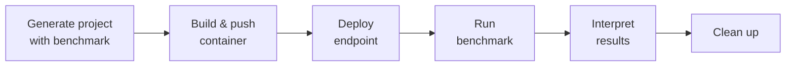

# Benchmarking

ML Container Creator can generate a `do/benchmark` script that measures LLM endpoint performance using the SageMaker AI Benchmarking service (powered by NVIDIA AIPerf). The script creates a workload configuration, runs a benchmark job against your deployed endpoint, polls for completion, and displays a results summary.

## Prerequisites

| Requirement | Details |
|---|---|
| Deployed endpoint | Endpoint must be `InService` (run `./do/deploy` first) |
| AWS credentials | Configured via `aws configure` or environment variables |
| Supported architecture | `transformers` or `diffusors` only (`transformers-vllm`, `transformers-sglang`, `transformers-tensorrt-llm`, `transformers-lmi`, `transformers-djl`, `diffusors-vllm-omni`) |
| Deployment target | `managed-inference` only (HyperPod EKS is not supported) |
| Bootstrapped account | Run `ml-container-creator bootstrap` to provision IAM permissions for benchmark APIs |

!!! note "Architecture Requirement"
    Benchmarking requires the OpenAI-compatible chat completions API, which is only available on transformer and diffusor model servers. HTTP and Triton architectures are not supported.

## Workflow

The typical benchmarking workflow follows the standard deploy-then-measure pattern:



### 1. Generate a project with benchmarking enabled

```bash
ml-container-creator my-llm-project \
  --deployment-config=transformers-vllm \
  --model-name=meta-llama/Llama-3.1-8B-Instruct \
  --instance-type=ml.g5.2xlarge \
  --deployment-target=managed-inference \
  --include-benchmark \
  --benchmark-concurrency=10 \
  --benchmark-input-tokens=550 \
  --benchmark-output-tokens=150 \
  --benchmark-streaming
```

### 2. Build and deploy

```bash
cd my-llm-project
./do/build        # or ./do/submit for CodeBuild
./do/push
./do/deploy
```

Wait for the endpoint to reach `InService` status.

### 3. Run the benchmark

```bash
./do/benchmark
```

The script will:

1. Verify the endpoint is `InService`
2. Create (or update) a Secrets Manager secret for the HuggingFace token (if `HF_TOKEN` is set in `do/config`)
3. Create an AI Workload Config with your benchmark parameters
4. Create an AI Benchmark Job targeting your endpoint's inference component
5. Poll every 30 seconds until the job completes (up to 30 minutes)
6. Download and display the results summary

### 4. Clean up benchmark resources

```bash
./do/benchmark --clean   # Clean after displaying results
./do/clean benchmark     # Clean benchmark resources independently
```

## Parameters

All benchmark parameters are set during project generation and stored in `do/config`. You can also edit `do/config` directly to adjust parameters between runs.

| Parameter | CLI Option | Default | Description |
|---|---|---|---|
| `includeBenchmark` | `--include-benchmark` | `false` | Enable benchmark script generation |
| `benchmarkConcurrency` | `--benchmark-concurrency` | `10` | Number of concurrent requests sent to the endpoint |
| `benchmarkInputTokensMean` | `--benchmark-input-tokens` | `550` | Mean number of input tokens per request |
| `benchmarkOutputTokensMean` | `--benchmark-output-tokens` | `150` | Mean number of output tokens per request |
| `benchmarkStreaming` | `--benchmark-streaming` | `true` | Enable streaming responses during benchmark |
| `benchmarkRequestCount` | `--benchmark-request-count` | Service default | Total number of requests to send (leave empty for service default) |
| `benchmarkS3OutputPath` | `--benchmark-s3-output-path` | Auto-generated | S3 URI for benchmark results output |

### Environment variables

| Variable | Description |
|---|---|
| `ML_INCLUDE_BENCHMARK` | Set to `true` to enable benchmarking (equivalent to `--include-benchmark`) |
| `ML_BENCHMARK_S3_OUTPUT_PATH` | Override the S3 output path for benchmark results |

### do/config variables

When benchmarking is enabled, the following variables are exported in `do/config`:

```bash
# SageMaker AI Benchmarking configuration
export BENCHMARK_CONCURRENCY="10"
export BENCHMARK_INPUT_TOKENS_MEAN="550"
export BENCHMARK_OUTPUT_TOKENS_MEAN="150"
export BENCHMARK_STREAMING="true"
export BENCHMARK_REQUEST_COUNT=""
export BENCHMARK_S3_OUTPUT_PATH="s3://ml-container-creator-benchmark-us-east-1-123456789012/my-llm-project/"
```

## Interpreting Results

When the benchmark job completes, `do/benchmark` displays a summary table with the following metrics:

### Throughput metrics

| Metric | Description |
|---|---|
| **Request throughput** | Number of completed requests per second |
| **Output token throughput** | Number of output tokens generated per second across all requests |

### Latency metrics

| Metric | Description |
|---|---|
| **Request latency P50** | Median end-to-end request latency |
| **Request latency P90** | 90th percentile end-to-end request latency |
| **Request latency P99** | 99th percentile end-to-end request latency |

### Streaming metrics (when streaming is enabled)

| Metric | Description |
|---|---|
| **TTFT P50** | Median time to first token — latency from request submission to first output token |
| **TTFT P90** | 90th percentile time to first token |
| **TTFT P99** | 99th percentile time to first token |
| **ITL P50** | Median inter-token latency — time between consecutive output tokens |
| **ITL P90** | 90th percentile inter-token latency |
| **ITL P99** | 99th percentile inter-token latency |

### What good results look like

- **TTFT** should be low (< 500ms for most models) — high TTFT indicates the model is slow to start generating
- **ITL** should be consistent — high variance suggests resource contention or batching delays
- **Request throughput** scales with concurrency — if throughput plateaus while increasing concurrency, the endpoint is saturated
- **P99 latency** much higher than P50 indicates tail latency issues, often caused by request queuing

### Tuning tips

- Increase `benchmarkConcurrency` to find the saturation point of your endpoint
- Adjust `benchmarkInputTokensMean` and `benchmarkOutputTokensMean` to match your expected production workload
- Run multiple benchmarks with different parameters to build a performance profile
- Compare results across instance types to find the best cost/performance ratio

## Cleanup

Benchmark resources (workload configs and benchmark jobs) persist in your AWS account after the benchmark completes. Clean them up to avoid clutter:

```bash
# Clean benchmark resources only
./do/clean benchmark

# Or use the --clean flag during benchmark execution
./do/benchmark --clean
```

The `benchmark` cleanup target:

- Deletes the workload config (`{project-name}-benchmark-config`)
- Deletes all completed/failed benchmark jobs matching `{project-name}-benchmark-*`
- Does **not** delete the Secrets Manager secret (managed separately)

The `./do/clean all` command also includes benchmark cleanup when benchmarking is enabled.

## Example: Full CLI invocation

Generate a project with all benchmark parameters specified for a fully non-interactive run:

```bash
ml-container-creator my-benchmark-project \
  --skip-prompts \
  --deployment-config=transformers-sglang \
  --model-name=meta-llama/Llama-3.1-8B-Instruct \
  --instance-type=ml.g5.2xlarge \
  --region=us-west-2 \
  --deployment-target=managed-inference \
  --build-target=codebuild \
  --include-benchmark \
  --benchmark-concurrency=20 \
  --benchmark-input-tokens=1024 \
  --benchmark-output-tokens=256 \
  --benchmark-streaming \
  --benchmark-request-count=100
```

Then deploy and benchmark:

```bash
cd my-benchmark-project
./do/submit          # Build via CodeBuild
./do/deploy          # Deploy to SageMaker
./do/benchmark       # Run the benchmark
./do/benchmark --clean  # Run again and clean up after
```

## Troubleshooting

### "Endpoint is not InService"

The benchmark requires a fully deployed endpoint. Check endpoint status:

```bash
aws sagemaker describe-endpoint --endpoint-name <your-endpoint> \
  --query 'EndpointStatus' --output text
```

Wait for `InService` status before running `./do/benchmark`.

### "UnrecognizedClientException"

The AI Benchmarking APIs may not be available in all AWS regions. Try deploying to `us-east-1` or `us-west-2` where the service is generally available.

### Benchmark job fails

Check the failure reason displayed by the script. Common causes:

- **Insufficient permissions** — Run `ml-container-creator bootstrap` to add benchmark IAM permissions
- **Endpoint not responding** — Verify the endpoint works with `./do/test` before benchmarking
- **Tokenizer access** — Ensure `HF_TOKEN` is set in `do/config` for gated models

### Benchmark times out

The default timeout is 30 minutes. If your benchmark needs more time (high request counts or slow endpoints), edit the `MAX_POLL_ATTEMPTS` variable in `do/benchmark`.
