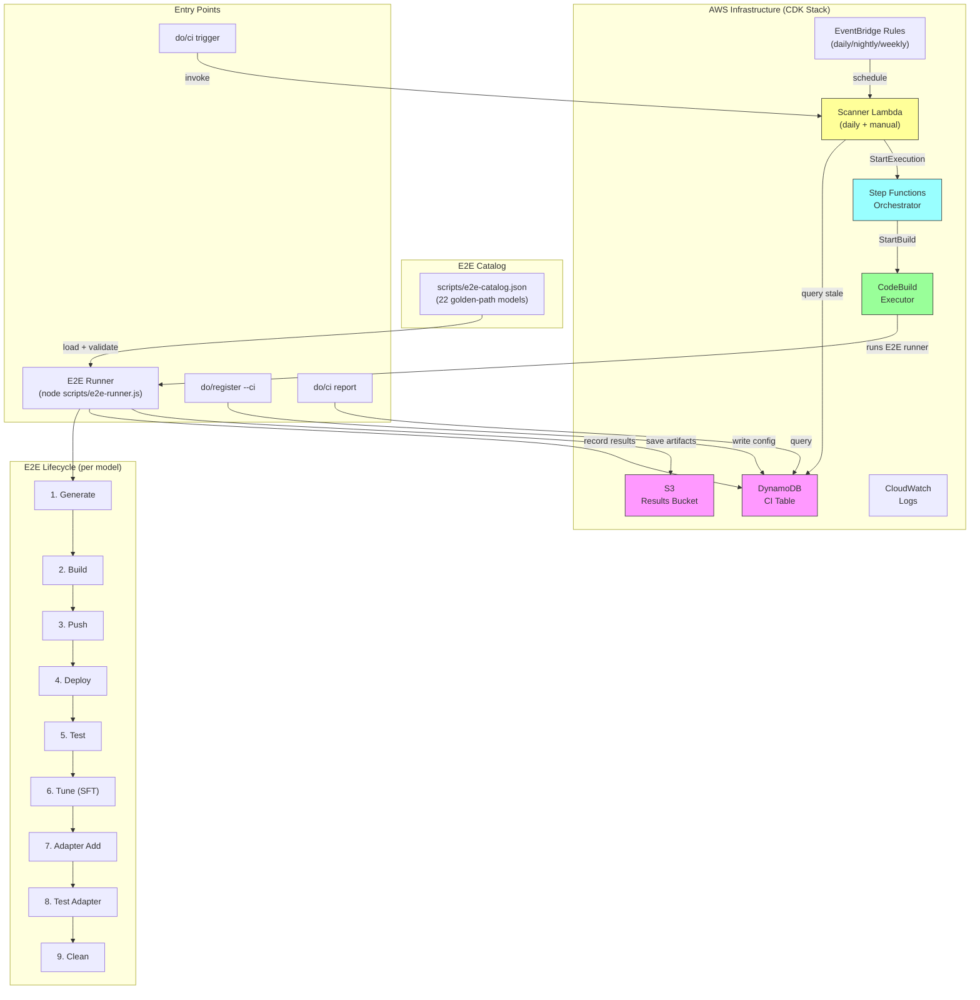

# CI Integration & E2E Validation

## Overview

MCC includes two complementary CI systems that validate generated containers work end-to-end:

1. **E2E Validation Runner** — Tests 22 golden-path models through the full lifecycle (build → deploy → test → tune → adapter → test-adapter → clean), organized in tiers by compute cost and frequency.
2. **CI Integration Harness** — Infrastructure-backed (Lambda + Step Functions + CodeBuild) system that automatically re-tests registered configurations on a schedule and detects regressions.

Both systems write results to the same DynamoDB CI table, giving a unified view of what's been validated and what's broken.

### Benefits

- **Golden path confidence** — 22 model + server + instance combinations are validated end-to-end, including fine-tuning and adapter serving
- **Tiered costs** — Small models test daily (~$8), medium models nightly (~$35), large models weekly (~$150)
- **Regression detection** — Catches breaking changes automatically across all configurations
- **Full lifecycle coverage** — Tests not just inference, but tune + adapter hot-swap (the iteration loop)

## Two-Stage CI Pipeline

MCC uses a **two-stage pipeline** for each configuration:

| Stage | Purpose | Duration | Blocking? |
|---|---|---|---|
| **Stage 1: CI Gate** | generate → build → push → deploy → test → register | ~15 min | Yes — sets `testStatus` |
| **Stage 2: Benchmark** | benchmark → write to Athena → update DynamoDB | ~30 min | No — `testStatus` unchanged |

### How It Works

1. **Stage 1** runs the full lifecycle. If it passes, `testStatus` is set to `pass` in DynamoDB.
2. If `benchmarkEnabled: true` for the configuration, **Stage 2** runs after Stage 1 succeeds.
3. Stage 2 runs `do/benchmark`, writes Parquet to S3, registers the partition in Athena, and updates the DynamoDB record with `lastBenchmarkRunId`, `lastBenchmarkTimestamp`, and `lastBenchmarkStatus`.
4. **Stage 2 failure is isolated** — a benchmark failure does NOT change `testStatus`. The configuration remains `pass`.

### Enabling Benchmarks

Set `benchmarkEnabled: true` on a configuration to opt it into Stage 2:

```bash
# During registration
./do/register --ci --benchmark-enabled

# Or update an existing config in DynamoDB
aws dynamodb update-item \
  --table-name mlcc-ci-table \
  --key '{"configId": {"S": "your-config-id"}}' \
  --update-expression 'SET benchmarkEnabled = :b' \
  --expression-attribute-values '{":b": {"BOOL": true}}'
```

### Benchmark Concurrency Levels

Control which concurrency levels are tested during Stage 2:

```json
{
  "benchmarkConcurrencyLevels": [1, 4, 8, 16, 32]
}
```

Default: `[1, 4, 8]`. Each level produces one row in the Athena benchmark_results table.

### Benchmark Results in DynamoDB

After Stage 2 completes, the DynamoDB record gains these fields:

| Field | Type | Description |
|---|---|---|
| `lastBenchmarkRunId` | String | e.g., `bmk-20260609T143022Z` |
| `lastBenchmarkTimestamp` | String | ISO 8601 |
| `lastBenchmarkStatus` | String | `completed`, `failed`, or `in-progress` |

Absence of `lastBenchmarkRunId` indicates the configuration has never been benchmarked.

### Benchmark Results in Athena

Rich metrics are written to the `mlcc_ci.benchmark_results` Athena table. See [Benchmarking](benchmarking.md) for the full schema and query patterns.

---

## Architecture



### Component Summary

| Component | Resource Name | Purpose |
|---|---|---|
| E2E Catalog | `scripts/e2e-catalog.json` | 22 golden-path model configurations with tune metadata |
| E2E Runner | `scripts/e2e-runner.js` | Executes full lifecycle per model, records results |
| Catalog Validator | `src/lib/e2e-catalog-validator.js` | Validates catalog schema + cross-references |
| DynamoDB Table | `mlcc-ci-table` | Authoritative source of test results |
| S3 Results Bucket | `mlcc-e2e-results-*` | JSON + markdown artifacts per run |
| Scanner Lambda | `mlcc-ci-scanner` | Queries for untested/stale configs |
| Step Functions | `mlcc-ci-orchestrator` | Orchestrates CodeBuild execution |
| CodeBuild Project | `mlcc-ci-executor` | Runs the E2E runner in a cloud environment |
| EventBridge Rules | `mlcc-ci-*-rule` | Daily, nightly, weekly schedules |
| CloudWatch Logs | `ml-container-creator-ci` | Centralized logging |

## Golden-Path Models (E2E Catalog)

The E2E catalog (`scripts/e2e-catalog.json`) defines 22 models organized in three tiers:

### Tier: CI (daily — 11 models, ~$8/run)

| Model | HuggingFace ID | Instance |
|---|---|---|
| Qwen 3 0.6B | `Qwen/Qwen3-0.6B` | ml.g5.xlarge |
| Qwen 3 1.7B | `Qwen/Qwen3-1.7B` | ml.g5.xlarge |
| Qwen 3 4B | `Qwen/Qwen3-4B` | ml.g5.xlarge |
| Qwen 3 8B | `Qwen/Qwen3-8B` | ml.g5.xlarge |
| Qwen 2.5 7B | `Qwen/Qwen2.5-7B-Instruct` | ml.g5.xlarge |
| Llama 3.2 1B | `meta-llama/Llama-3.2-1B-Instruct` | ml.g5.xlarge |
| Llama 3.2 3B | `meta-llama/Llama-3.2-3B-Instruct` | ml.g5.xlarge |
| Llama 3.1 8B | `meta-llama/Llama-3.1-8B-Instruct` | ml.g5.xlarge |
| DS R1 Distill-Qwen 1.5B | `deepseek-ai/DeepSeek-R1-Distill-Qwen-1.5B` | ml.g5.xlarge |
| DS R1 Distill-Qwen 7B | `deepseek-ai/DeepSeek-R1-Distill-Qwen-7B` | ml.g5.xlarge |
| DS R1 Distill-Llama 8B | `deepseek-ai/DeepSeek-R1-Distill-Llama-8B` | ml.g5.xlarge |

### Tier: Nightly (7 models, ~$35/run)

| Model | HuggingFace ID | Instance |
|---|---|---|
| Qwen 3 14B | `Qwen/Qwen3-14B` | ml.g5.2xlarge |
| Qwen 2.5 14B | `Qwen/Qwen2.5-14B-Instruct` | ml.g5.2xlarge |
| DS R1 Distill-Qwen 14B | `deepseek-ai/DeepSeek-R1-Distill-Qwen-14B` | ml.g5.2xlarge |
| GPT-OSS 20B | `openai/gpt-oss-20b` | ml.g5.12xlarge |
| Qwen 3 32B | `Qwen/Qwen3-32B` | ml.g5.12xlarge |
| Qwen 2.5 32B | `Qwen/Qwen2.5-32B-Instruct` | ml.g5.12xlarge |
| DS R1 Distill-Qwen 32B | `deepseek-ai/DeepSeek-R1-Distill-Qwen-32B` | ml.g5.12xlarge |

### Tier: Weekly (4 models, ~$150/run)

| Model | HuggingFace ID | Instance |
|---|---|---|
| Qwen 2.5 72B | `Qwen/Qwen2.5-72B-Instruct` | ml.g5.48xlarge |
| Llama 3.3 70B | `meta-llama/Llama-3.3-70B-Instruct` | ml.g5.48xlarge |
| DS R1 Distill-Llama 70B | `deepseek-ai/DeepSeek-R1-Distill-Llama-70B` | ml.g5.48xlarge |
| GPT-OSS 120B | `openai/gpt-oss-120b` | ml.g5.48xlarge |

All models use:
- **Serving engine**: vLLM
- **Deployment config**: `transformers-vllm`
- **Deployment target**: realtime-inference (SageMaker AI real-time endpoints)
- **LoRA enabled**: Yes (required for tune/adapter lifecycle)
- **Lifecycle**: `build → push → deploy → test → tune-sft → adapter-add → test-adapter → clean`

## Setup

### Enabling CI During Bootstrap

CI infrastructure is provisioned via the bootstrap command. You can enable it during initial setup or add it later.

**During initial bootstrap:**

```bash
ml-container-creator bootstrap
```

When prompted, answer **Yes** to the CI Integration question. The bootstrap process will:

1. Run `cdk bootstrap` if needed (one-time CDK setup)
2. Deploy the `MlccCiHarnessStack` via CDK
3. Create all resources listed in the architecture diagram

**Adding CI to an existing bootstrap:**

```bash
ml-container-creator bootstrap update --ci
```

This deploys the CI stack without affecting your existing IAM roles, ECR repositories, or S3 buckets.

#### Benchmark Infrastructure (`--benchmark-infra`)

To enable Stage 2 (Athena-backed benchmark persistence), add the `--benchmark-infra` flag:

```bash
ml-container-creator bootstrap --ci --benchmark-infra
ml-container-creator bootstrap update --ci --benchmark-infra
```

This provisions:

- **Glue database** (`mlcc_ci`)
- **Athena table** (`benchmark_results`) with the full metrics schema
- **S3 results bucket** (`mlcc-benchmark-results-{accountId}-{region}`)

Without `--benchmark-infra`, CI deploys only the DynamoDB table, Lambda, Step Functions, and CodeBuild — Stage 2 writes will fail silently if the Glue/Athena infrastructure doesn't exist.

---

### CI Harness Roles (Region-Scoped)

CI IAM role names include the region to prevent cross-region conflicts:

| Role | Purpose |
|---|---|
| `mlcc-ci-scanner-role-{region}` | Lambda scanner execution |
| `mlcc-ci-orchestrator-role-{region}` | Step Functions execution |
| `mlcc-ci-codebuild-role-{region}` | CodeBuild executor |

For example, in `us-west-2`: `mlcc-ci-orchestrator-role-us-west-2`.

This means you can deploy CI harnesses in multiple regions without IAM conflicts (one per account, but role names won't clash if you tear down and redeploy in a different region).

---

### Teardown and Rebuild

The CI harness stack can be torn down and rebuilt cleanly:

```bash
# Delete the CI harness (retains DynamoDB data via RETAIN policy on table)
aws cloudformation delete-stack --stack-name MlccCiHarnessStack --region <region>

# Rebuild fresh
ml-container-creator bootstrap update --ci --benchmark-infra
```

**Roles are disposable** — they do NOT have `RemovalPolicy.RETAIN`. Deleting the stack removes the IAM roles. Re-running `bootstrap --ci` creates them fresh with the correct permissions. No orphaned resources.

This is the recommended approach if you encounter role conflicts or need to move CI to a different region.


### Prerequisites

- AWS CLI configured with credentials that have CloudFormation, Lambda, DynamoDB, CodeBuild, Step Functions, and IAM permissions
- Node.js 24+ (for CDK deployment)
- An existing bootstrap (IAM execution role, ECR repository)
- HuggingFace token in Secrets Manager (for model downloads): `mlcc/hf-token`
- SFT training datasets uploaded to `s3://mlcc-e2e-datasets/`

## Running E2E Validation

### Using the E2E Runner (Local or CI)

The E2E runner is the primary way to validate models. It reads the catalog, generates projects, and runs the full lifecycle:

```bash
# Run the CI tier (11 small models, ~45 min, ~$8)
node scripts/e2e-runner.js --tier ci

# Run the nightly tier (7 medium models, ~3 hrs, ~$35)
node scripts/e2e-runner.js --tier nightly

# Run the weekly tier (4 large models, ~6 hrs, ~$150)
node scripts/e2e-runner.js --tier weekly
```

### Re-running a Single Model

After identifying a failure, re-run that specific config:

```bash
node scripts/e2e-runner.js --config rt-qwen3-06b --verbose
```

The `--config` flag searches across all tiers, so you don't need to specify `--tier`.

### Dry Run (Step Validation Only)

Verify catalog entries and step resolution without executing anything:

```bash
node scripts/e2e-runner.js --tier ci --dry-run
```

### Saving Results Locally

If you don't have CI infrastructure provisioned (no DynamoDB table), results save to local files automatically. You can also force local output:

```bash
node scripts/e2e-runner.js --tier ci --save-local ./validation-results/
```

## Lifecycle Stages

Each E2E run executes these stages sequentially for every model:

### 1. Generate

Creates a fresh project from the catalog entry's args:

```bash
ml-container-creator <project-name> \
  --deployment-config=transformers-vllm \
  --model-name=<hf-id> \
  --instance-type=<instance> \
  --region=us-west-2 \
  --enable-lora \
  --skip-prompts
```

### 2. Build

Builds the Docker container:

```bash
./do/build
```

### 3. Push

Pushes the container image to ECR:

```bash
./do/push
```

### 4. Deploy

Deploys to a SageMaker AI real-time endpoint:

```bash
./do/deploy
```

### 5. Test (Base Model)

Validates inference against the base model:

```bash
./do/test
```

### 6. Tune (SFT)

Fine-tunes the model using SageMaker AI managed customization:

```bash
./do/tune --technique sft --dataset s3://mlcc-e2e-datasets/sft-small/train.jsonl --training-type lora
```

This is a serverless operation — MCC submits the job and waits for completion.

### 7. Adapter Add

Hot-swaps the trained LoRA adapter onto the running endpoint:

```bash
./do/adapter add tuned-sft --from-tune sft
```

### 8. Test (Adapter)

Validates inference against the adapter:

```bash
./do/test --adapter
```

### 9. Clean

Tears down all resources:

```bash
./do/clean all
```

**Clean always runs**, regardless of prior failures.

## Stage Failure Handling

The runner uses **tune-aware fail-fast with guaranteed cleanup**:

1. **Non-tune failure stops everything** — If build, push, deploy, or test (base) fails, subsequent stages are skipped
2. **Tune failure skips adapter stages only** — If `tune-sft` fails, `adapter-add` and `test-adapter` are marked `skipped`, but clean still runs
3. **Clean always runs** — Resources are torn down regardless of outcome
4. **Final status reflects the first failure** — e.g., `fail-tune-sft` means tuning was the first stage to fail

Each stage captures:

- **Status**: `pass`, `fail`, or `skip`
- **Duration**: Wall-clock seconds
- **Error summary**: Last 500 characters of stderr on failure

## Registration

### How `do/register --ci` Works

Every generated project includes a `do/register` script. The `--ci` flag writes the project's configuration to the CI DynamoDB table:

```bash
./do/register --ci
```

**What happens:**

1. Reads the project's `do/config` to extract deployment parameters
2. Computes a deterministic `configId` from canonical fields (SHA-256 hash, first 16 hex chars)
3. Writes (or updates) the record in the CI table

The E2E runner also writes directly to the CI table after each model completes, so `do/register --ci` is not required when using the runner.

### configId Hashing

```
SHA-256( deploymentConfig:modelName:instanceType:region:deploymentTarget )
```

For example:

```bash
# Input: "transformers-vllm:Qwen/Qwen3-4B:ml.g5.xlarge:us-west-2:realtime-inference"
# configId: "a3f8b2c1d4e5f6a7" (first 16 hex chars)
```

### What Gets Stored in DynamoDB

| Attribute | Type | Description |
|---|---|---|
| `configId` | String (PK) | 16-char hex hash of canonical fields |
| `schemaVersion` | Number | Record schema version (`2`) |
| `configJson` | String | Compact JSON with all generation parameters |
| `testStatus` | String | `untested`, `pass`, `fail-{stage}`, `running` |
| `lastTestTimestamp` | String | ISO 8601 timestamp of last test completion |
| `lastTestDuration` | Number | Total test duration in seconds |
| `e2eCatalogId` | String | Catalog entry ID (e.g., `rt-qwen3-4b`) |
| `tier` | String | `ci`, `nightly`, or `weekly` |
| `stageResults` | Map | Per-stage status, duration, and error summary |
| `errorMessage` | String | Error summary from the first failing stage |

## Triggering Scheduled Runs

### Automatic (Tiered Schedule)

EventBridge rules trigger validation at different frequencies:

| Tier | Schedule | Trigger |
|---|---|---|
| CI | Daily at 6:00 UTC | `cron(0 6 * * ? *)` |
| Nightly | Daily at 2:00 UTC | `cron(0 2 * * ? *)` |
| Weekly | Sunday at 2:00 UTC | `cron(0 2 ? * SUN *)` |

Each rule invokes a CodeBuild project that runs `node scripts/e2e-runner.js --tier <tier>`.

### Manual Trigger

```bash
./do/ci trigger
```

Directly invokes the Scanner Lambda, which starts Step Functions executions for any stale or untested configurations.

## Monitoring

### Coverage Report

```bash
./do/ci report
```

Shows test status across all 22 golden-path models:

```
📊 CI Coverage Report
━━━━━━━━━━━━━━━━━━━━━━━━━━━━━━━━━━━━━━━━━━━━━━━━━━━━━━━━━━━━━━━━━━━━━━━━━━━━━━

  Tier     Config                    Status           Last Test              Duration
  ─────────────────────────────────────────────────────────────────────────────────
  ci       rt-qwen3-06b              pass             2026-05-22T06:15:00Z       312s
  ci       rt-qwen3-17b              pass             2026-05-22T06:22:00Z       428s
  ci       rt-qwen3-4b               pass             2026-05-22T06:31:00Z       534s
  ci       rt-llama32-1b             fail-tune-sft    2026-05-22T06:35:00Z       287s
  ...
  nightly  rt-qwen3-14b              pass             2026-05-22T02:15:00Z      1842s
  ...
  weekly   rt-qwen25-72b             pass             2026-05-18T02:15:00Z      5234s
  ...

  Summary: 22 total | 20 passing | 1 failing | 1 untested | 91% coverage
```

Regressions are flagged with `⚠️ REGRESSION` when a previously-passing config now fails.

For machine-readable output:

```bash
./do/ci report --json
```

### Status Summary

```bash
./do/ci status
```

### Dashboard

```bash
./do/ci dashboard
./do/ci dashboard --port 8080
```

Starts a local web dashboard at `http://localhost:3939` with auto-refresh.

## Cost Considerations

### Per-Tier Costs

| Tier | Models | Instance Class | Est. Time | Est. Cost |
|---|---|---|---|---|
| CI (daily) | 11 | g5.xlarge | ~45 min | ~$8 |
| Nightly | 7 | g5.2xlarge / g5.12xlarge | ~3 hrs | ~$35 |
| Weekly | 4 | g5.48xlarge | ~6 hrs | ~$150 |

Plus serverless tuning costs ($5–50 per model depending on size).

### Always-On Costs

| Resource | Cost |
|---|---|
| DynamoDB (on-demand) | ~$0/month for CI-scale reads/writes |
| Lambda (256MB, daily) | ~$0.01/month |
| EventBridge rules | Free |
| CloudWatch Logs (3-month retention) | < $1/month |
| Step Functions | < $1/month |
| S3 results bucket | < $1/month |

### Cost Optimization

- **Run CI tier only during development** — Skip nightly/weekly until CI is green
- **Use `--config` for targeted re-runs** — Don't re-run the full tier for one failure
- **`MaxConcurrency: 1`** (default) — Prevents parallel endpoint spend
- **Monitor with `./do/ci report`** — Identify and fix failures early

### Removing CI Infrastructure

```bash
cd infra/ci-harness
cdk destroy MlccCiHarnessStack
```

## Troubleshooting

### Common Issues

#### CI Infrastructure Not Provisioned

```
⚠️  CI table not provisioned — saving results locally only.
```

**Resolution**: Run `ml-container-creator bootstrap update --ci` to deploy the CI stack. The runner still works without it (results save locally).

#### Tune Stage Timeout

Tune stages have independent timeouts (longer than inference steps). If a tune job exceeds `tuneTimeout`:

- The runner marks it as `fail-tune-sft`
- Adapter stages are skipped
- Clean still runs
- Check the SageMaker AI console for the training job status

#### Deploy Stage — ResourceLimitExceeded

```
ResourceLimitExceeded: Account-level service limit exceeded
```

**Resolution**: Request a quota increase for the instance type via the AWS Service Quotas console. This is common for `ml.g5.12xlarge` and `ml.g5.48xlarge`.

#### Missing HuggingFace Token

```
Error: Token required for gated model
```

**Resolution**: Store your HF token in Secrets Manager:
```bash
aws secretsmanager create-secret --name mlcc/hf-token --secret-string "hf_..."
```

#### Build Timeout

The CodeBuild project has a 90-minute build timeout (8 hours for weekly tier). If exceeded:

- The Step Functions orchestrator detects the failure
- Results are recorded as `fail-build`
- Check CloudWatch logs for what's slow (usually large model weight downloads)

### Viewing Logs

```bash
# View recent E2E runner output
aws logs filter-log-events \
  --log-group-name ml-container-creator-ci \
  --log-stream-name-prefix build/ \
  --start-time $(date -d '1 hour ago' +%s000)

# View a specific config's last run
aws logs filter-log-events \
  --log-group-name ml-container-creator-ci \
  --log-stream-name-prefix build/<configId>/
```

## Reference

### CLI Commands

| Command | Description |
|---|---|
| `node scripts/e2e-runner.js --tier ci` | Run all CI-tier models |
| `node scripts/e2e-runner.js --tier nightly` | Run all nightly-tier models |
| `node scripts/e2e-runner.js --tier weekly` | Run all weekly-tier models |
| `node scripts/e2e-runner.js --config <id>` | Run a single model by catalog ID |
| `node scripts/e2e-runner.js --dry-run` | Validate catalog + step resolution without executing |
| `node scripts/e2e-runner.js --verbose` | Stream stdout/stderr in real time |
| `node scripts/e2e-runner.js --save-local <dir>` | Force local artifact output |
| `./do/register --ci` | Register this project for CI testing |
| `./do/ci report` | Coverage report across all models |
| `./do/ci report --json` | Machine-readable coverage report |
| `./do/ci status` | Aggregate CI system status |
| `./do/ci trigger` | Manually invoke the scanner |
| `./do/ci dashboard` | Start local web dashboard |

### Test Status Values

| Status | Meaning |
|---|---|
| `untested` | In catalog but never tested |
| `running` | Currently being tested |
| `pass` | All lifecycle stages completed successfully |
| `fail-generate` | Project generation failed |
| `fail-build` | Docker build failed |
| `fail-push` | ECR push failed |
| `fail-deploy` | Endpoint deployment failed |
| `fail-test` | Base model inference test failed |
| `fail-tune-sft` | Fine-tuning job failed |
| `fail-adapter-add` | Adapter attachment failed |
| `fail-test-adapter` | Adapter inference test failed |
| `fail-clean` | Cleanup failed (resources may remain) |

### Catalog Entry Schema

Each entry in `scripts/e2e-catalog.json`:

```json
{
  "id": "rt-qwen3-4b",
  "tier": "ci",
  "track": "realtime",
  "args": "--deployment-config=transformers-vllm --model-name=Qwen/Qwen3-4B --instance-type=ml.g5.xlarge --region=us-west-2 --deployment-target=realtime-inference --enable-lora",
  "lifecycle": ["build", "push", "deploy", "test", "tune-sft", "adapter-add", "test-adapter", "clean"],
  "timeout": 1800,
  "tuneTimeout": 3600,
  "tuneConfig": {
    "tuneId": "qwen3-4b",
    "technique": "sft",
    "trainingType": "lora",
    "dataset": "s3://mlcc-e2e-datasets/sft-small/train.jsonl"
  }
}
```
