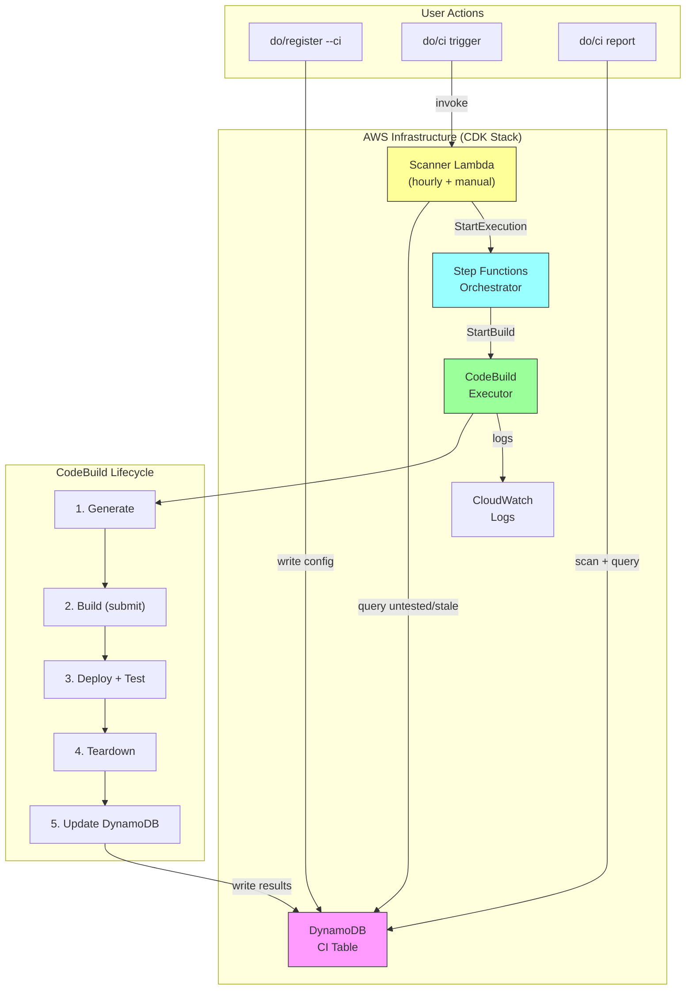

# CI Integration Harness

## Overview

The CI Integration Harness automatically tests generated ML container configurations through their full lifecycle — generate, build, deploy, test, and teardown. It validates that every supported deployment configuration produces a working SageMaker endpoint, catching regressions before they reach users.

When you register a project configuration for CI testing, the harness periodically regenerates the project from scratch, builds the container, deploys it to SageMaker, runs inference tests, tears everything down, and records the results. This gives you confidence that the generator produces working containers for every supported configuration.

### Benefits

- **Regression detection** — Catches breaking changes across all 15 deployment configurations automatically
- **Configuration validation** — Proves that each config produces a deployable, testable endpoint end-to-end
- **Confidence scores** — Provides pass/fail history for catalog entries, informing users which configs are battle-tested
- **Coverage visibility** — Shows which configurations have been tested recently and which are stale

## Architecture



### Component Summary

| Component | Resource Name | Purpose |
|---|---|---|
| DynamoDB Table | `mlcc-ci-table` | Stores test configurations and results |
| Scanner Lambda | `mlcc-ci-scanner` | Queries for untested/stale configs, starts executions |
| Step Functions | `mlcc-ci-orchestrator` | Orchestrates CodeBuild and polls for completion |
| CodeBuild Project | `mlcc-ci-executor` | Runs the full lifecycle (generate → teardown) |
| EventBridge Rule | `mlcc-ci-scanner-schedule` | Triggers the scanner every hour |
| CloudWatch Logs | `ml-container-creator-ci` | Centralized logging for all CI components |

## Setup

### Enabling CI During Bootstrap

CI infrastructure is provisioned via the bootstrap command. You can enable it during initial setup or add it later.

**During initial bootstrap:**

```bash
ml-container-creator bootstrap
```

When prompted, answer **Yes** to the CI Integration question. The bootstrap process will:

1. Run `cdk bootstrap` if needed (one-time CDK setup)
2. Deploy the `MlccCiHarnessStack` via CDK
3. Create all resources listed in the architecture diagram

**Adding CI to an existing bootstrap:**

```bash
ml-container-creator bootstrap update --ci
```

This deploys the CI stack without affecting your existing IAM roles, ECR repositories, or S3 buckets.

### Prerequisites

- AWS CLI configured with credentials that have CloudFormation, Lambda, DynamoDB, CodeBuild, Step Functions, and IAM permissions
- Node.js 24+ (for CDK deployment)
- An existing bootstrap (IAM execution role, ECR repository)

## Registration

### How `do/register --ci` Works

Every generated project includes a `do/register` script. The `--ci` flag writes the project's configuration to the CI DynamoDB table so the harness will test it automatically.

```bash
./do/register --ci
./do/register --ci --build-strategy docker-in-docker
```

**What happens:**

1. Reads the project's `do/config` to extract deployment parameters
2. Computes a deterministic `configId` from canonical fields
3. Builds a compact `configJson` containing everything needed to regenerate the project
4. Writes (or updates) the record in the CI table with `testStatus: untested`

!!! note "Developer Note"
    `do/register --ci` is currently the **only** way to create CI records in DynamoDB. There is no bulk registration, no API endpoint, and no way to register configs without generating a project first. This means testing a new deployment config requires: generate → register → trigger. This workflow may change in a future release to support direct registration from catalog entries or config files without project generation.

### configId Hashing

The `configId` is a 16-character hex string derived from a SHA-256 hash of the canonical deployment identity:

```
SHA-256( deploymentConfig:modelName:instanceType:region:deploymentTarget )
```

For example:

```bash
# Input: "transformers-vllm:meta-llama/Llama-2-7b-chat-hf:ml.g5.xlarge:us-east-1:managed-inference"
# configId: "a3f8b2c1d4e5f6a7" (first 16 hex chars of SHA-256)
```

This means:

- The same configuration always produces the same `configId` (idempotent registration)
- Re-registering updates the existing record and resets `testStatus` to `untested`
- Different model names, instance types, or regions produce different records

### What Gets Stored in DynamoDB

| Attribute | Type | Description |
|---|---|---|
| `configId` | String (PK) | 16-char hex hash of canonical fields |
| `schemaVersion` | Number | Record schema version (currently `1`) |
| `configJson` | String | Compact JSON with all generation parameters |
| `testStatus` | String | `untested`, `pass`, `fail-generate`, `fail-build`, `fail-deploy_test`, `running` |
| `lastTestTimestamp` | String | ISO 8601 timestamp of last test completion |
| `lastTestDuration` | Number | Total test duration in seconds |
| `deploymentConfig` | String | Promoted for GSI queries (e.g., `transformers-vllm`) |
| `baseImage` | String | Container base image (e.g., `vllm/vllm-openai:v0.8.5`) |
| `projectName` | String | Project name used during generation |
| `stageResults` | Map | Per-stage status, duration, log pointer, and error summary |
| `errorMessage` | String | Error summary from the first failing stage |

## Triggering CI Runs

### Automatic (Hourly Schedule)

An EventBridge rule triggers the Scanner Lambda every hour. The scanner queries the DynamoDB GSI for:

1. **All records with `testStatus = untested`** — newly registered configs
2. **Records with `lastTestTimestamp` older than 24 hours** — stale configs that need re-testing

Records with `testStatus = running` are always excluded to prevent duplicate executions.

### Manual Trigger

```bash
./do/ci trigger
```

This directly invokes the Scanner Lambda, which queries for qualifying records and starts Step Functions executions immediately. Use this after registering new configs or when you want results without waiting for the next hourly run.

**Example output:**

```
🚀 Triggering CI Scanner Lambda
━━━━━━━━━━━━━━━━━━━━━━━━━━━━━━━━━━━━━━━━━━━━━━━━━━━━━━━━━━━━━━━━━━━━━━━━━━━━━━

✅ Scanner Lambda invoked successfully

   Response:
{
  "executionArns": [
    "arn:aws:states:us-east-1:123456789012:execution:mlcc-ci-orchestrator:abc123"
  ]
}
```

## Monitoring

### Coverage Report

```bash
./do/ci report
```

Shows the test status across all 15 known deployment configurations:

```
📊 CI Coverage Report
━━━━━━━━━━━━━━━━━━━━━━━━━━━━━━━━━━━━━━━━━━━━━━━━━━━━━━━━━━━━━━━━━━━━━━━━━━━━━━

  Config                         Status           Project              Last Test              Duration
  ----------------------------------------------------------------------------------------------------
  transformers-vllm              pass             test-vllm            2024-01-15T10:30:00Z         842s
  transformers-sglang            pass             test-sglang          2024-01-15T09:15:00Z         756s
  transformers-lmi               fail-build       test-lmi             2024-01-14T22:00:00Z         123s
  http-flask                     pass             test-flask           2024-01-15T08:00:00Z         234s
  http-fastapi                   untested         -                    -                              -
  ...

  Summary: 15 total | 10 tested | 8 passing | 2 failing | 5 untested | 66.7% coverage
```

The report also detects **regressions** — deployment configurations whose latest test status is `fail-*` but had a previous `pass` result. These are flagged with a `⚠️ REGRESSION` indicator in the status column, making it easy to spot configs that broke after previously working.

For machine-readable output:

```bash
./do/ci report --json
```

### Status Summary

```bash
./do/ci status
```

Shows aggregate counts without per-config detail:

```
📋 CI System Status
━━━━━━━━━━━━━━━━━━━━━━━━━━━━━━━━━━━━━━━━━━━━━━━━━━━━━━━━━━━━━━━━━━━━━━━━━━━━━━

  Total records:     12
  Running:           1
  Passing:           8
  Failing:           2
  Untested:          1
  Last completed:    2024-01-15T10:30:00Z
```

### Dashboard

```bash
./do/ci dashboard
./do/ci dashboard --port 8080
```

Starts a local web dashboard at `http://localhost:3939` (default) that auto-refreshes every 60 seconds. Shows all CI records with color-coded status badges and per-stage progress indicators.

## Lifecycle Stages

Each CI run executes these stages sequentially within a CodeBuild build:

### 1. Generate

Regenerates the project from the stored `configJson`:

```bash
ml-container-creator --config /tmp/ci-config.json --skip-prompts --force
```

### 2. Validate (placeholder)

Reserved for future static analysis checks (linting, schema validation). Currently passes immediately.

### 3. Build

Executes the project's build strategy:

- **`codebuild-submit`** (default): Runs `./do/submit` to create a nested CodeBuild project that builds and pushes the Docker image to ECR
- **`docker-in-docker`**: Runs `./do/build` and `./do/push` directly (requires privileged mode)

### 4. Deploy + Test

Deploys the container to a SageMaker endpoint and runs inference tests:

```bash
./do/deploy    # Create endpoint, wait for InService
./do/test      # Run health check and inference request
```

### 5. Register (placeholder)

Reserved for future catalog registration. Currently passes immediately.

### 6. Teardown

**Always runs**, regardless of prior failures. Cleans up all deployed resources:

```bash
./do/clean all --force    # Delete endpoint, ECR images, CodeBuild project
```

### 7. Update

Writes final results to DynamoDB with per-stage status, duration, log pointers, and error summaries.

## Stage Failure Handling

The CI harness uses a **fail-fast with guaranteed cleanup** strategy:

1. **First failure stops subsequent stages** — If Generate fails, Build/Deploy/Test are skipped
2. **Teardown always runs** — Even after failures, resources are cleaned up
3. **Update always runs** — Results are written to DynamoDB regardless of outcome
4. **Final status reflects the first failure** — e.g., `fail-build` means Build was the first stage to fail

Each stage captures:

- **Status**: `pass`, `fail`, or `skip`
- **Duration**: Wall-clock seconds for the stage
- **Log pointer**: CloudWatch log stream reference
- **Error summary**: Last 500 characters of stderr on failure

## Troubleshooting

### Common Issues

#### Missing ROLE_ARN

```
Error: ROLE_ARN environment variable is required for deployment
```

**Cause**: The SageMaker execution role ARN isn't set in the CodeBuild environment.

**Resolution**: The CI stack sets `ROLE_ARN` to `arn:aws:iam::<account>:role/mlcc-sagemaker-execution-role`. Verify this role exists (created during bootstrap).

#### CodeBuild Permissions

```
AccessDeniedException: User is not authorized to perform codebuild:CreateProject
```

**Cause**: The CI CodeBuild role needs broad permissions to create nested CodeBuild projects for the `codebuild-submit` build strategy.

**Resolution**: The CDK stack grants `codebuild:*` to the executor role. If you've customized IAM policies, ensure nested project creation is allowed.

#### CI Infrastructure Not Provisioned

```
❌ CI infrastructure not provisioned.
   Run 'ml-container-creator bootstrap' with CI enabled.
```

**Cause**: The `do/ci` commands check for the DynamoDB table before executing. If the table doesn't exist, CI hasn't been set up.

**Resolution**: Run `ml-container-creator bootstrap update --ci` to deploy the CI stack.

#### Build Timeout (90 minutes)

The CodeBuild project has a 90-minute build timeout. If the build exceeds this:

- The buildspec's `post_build` phase writes `fail-build` status to DynamoDB with a timeout error message
- If `post_build` itself doesn't run (hard timeout), the Step Functions orchestrator detects the failed build and records the failure
- Check CloudWatch logs for the build to understand what's taking so long

### Viewing Logs

All CI components log to the `ml-container-creator-ci` CloudWatch log group:

- **Scanner logs**: `scanner/*` prefix
- **Build logs**: `build/<configId>/<timestamp>` prefix
- **Step Functions**: Execution history in the AWS console

```bash
# View recent scanner invocations
aws logs filter-log-events \
  --log-group-name ml-container-creator-ci \
  --log-stream-name-prefix scanner/ \
  --start-time $(date -d '1 hour ago' +%s000)

# View a specific build
aws logs filter-log-events \
  --log-group-name ml-container-creator-ci \
  --log-stream-name-prefix build/<configId>/
```

## Cost Considerations

### Per-Run Costs

Each CI run creates and destroys these resources:

| Resource | Duration | Estimated Cost |
|---|---|---|
| CodeBuild (MEDIUM compute) | 10–60 min | $0.01–$0.06/min |
| SageMaker endpoint (varies by instance) | 5–15 min | Instance-dependent |
| ECR storage (temporary) | Minutes | Negligible |
| Nested CodeBuild (for submit strategy) | 10–45 min | $0.01–$0.06/min |

**Typical cost per run**: $0.50–$5.00 depending on instance type and build duration.

GPU instances (ml.g5.xlarge, ml.g6.12xlarge) are significantly more expensive during the Deploy+Test stage.

### Always-On Costs

| Resource | Cost |
|---|---|
| DynamoDB (on-demand) | ~$0/month for CI-scale reads/writes |
| Lambda (256MB, hourly) | ~$0.01/month |
| EventBridge rule | Free |
| CloudWatch Logs (3-month retention) | Storage-dependent, typically < $1/month |
| Step Functions | $0.025 per 1,000 state transitions |

### Cost Optimization Tips

- **Reduce scan frequency**: The hourly schedule can be changed to every 4–6 hours for lower-traffic setups
- **Limit concurrent executions**: The `MaxConcurrency` stack parameter (default: 1) prevents runaway costs
- **Use smaller instances for CI**: Register configs with `ml.m5.large` or `ml.g4dn.xlarge` instead of production-sized instances
- **Monitor with `do/ci report`**: Identify failing configs early to avoid repeated teardown/retry cycles

### Cleanup

To remove all CI infrastructure:

```bash
# Delete the CDK stack
cd infra/ci-harness
cdk destroy MlccCiHarnessStack
```

This removes the DynamoDB table, Lambda, Step Functions, CodeBuild project, EventBridge rule, and all associated IAM roles. CloudWatch logs are retained per the retention policy (3 months) unless manually deleted.

## Reference

### CLI Commands

| Command | Description |
|---|---|
| `./do/register --ci` | Register this project's config for CI testing |
| `./do/register --ci --ci-table NAME` | Register to a custom CI table (default: `mlcc-ci-table`) |
| `./do/ci report` | Show coverage across all deployment configs |
| `./do/ci report --json` | Machine-readable coverage report |
| `./do/ci status` | Show aggregate CI system status |
| `./do/ci trigger` | Manually invoke the scanner to start test runs |
| `./do/ci dashboard` | Start local web dashboard (port 3939) |
| `./do/ci dashboard --port N` | Start dashboard on custom port |

### DynamoDB GSI

The CI table has a Global Secondary Index for efficient scanner queries:

- **Index name**: `testStatus-lastTestTimestamp-index`
- **Partition key**: `testStatus` (String)
- **Sort key**: `lastTestTimestamp` (String, ISO 8601)

This allows the scanner to query all records with a specific status and filter by timestamp in a single query operation.

### Test Status Values

| Status | Meaning |
|---|---|
| `untested` | Registered but never tested |
| `running` | Currently being tested |
| `pass` | All stages completed successfully |
| `fail-generate` | Generation stage failed |
| `fail-validate` | Validation stage failed |
| `fail-build` | Build stage failed |
| `fail-deploy_test` | Deploy+Test stage failed |
| `fail-teardown` | Teardown stage failed (resources may remain) |

### Known Deployment Configurations

The CI harness tracks 15 deployment configurations from the catalog:

| Architecture | Configurations |
|---|---|
| Transformers | vllm, sglang, lmi, djl, tensorrt-llm |
| HTTP | flask, fastapi, nginx |
| Triton | fil, python, onnx, tensorrt |
| Diffusors | vllm, sglang, comfyui |
