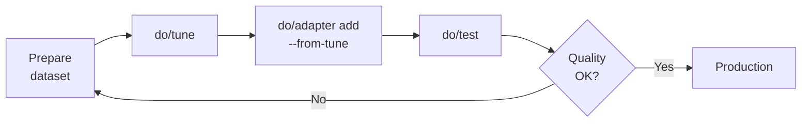

# Fine-Tuning & Customization

ML Container Creator includes a `do/tune` command that wraps SageMaker AI Managed Model Customization — a serverless fine-tuning capability that eliminates instance selection and container management. You provide a dataset and technique; SageMaker handles infrastructure, optimization, and produces a deployable model artifact that feeds directly back into your project's deployment lifecycle.

## Prerequisites

| Requirement | Details |
|---|---|
| Deployed endpoint | Endpoint must be `InService` (run `./do/deploy` first) |
| AWS credentials | Configured via `aws configure` or environment variables |
| Framework | `transformers` only |
| Deployment target | Any target except `batch-transform` |
| Bootstrapped account | Run `ml-container-creator bootstrap` to provision IAM permissions and tune S3 bucket |
| Python SDK | `sagemaker>=2.232.0` installed in your Python environment |

!!! note "Supported Models Only"
    `do/tune` works with models in the Supported Model Catalog. If your model isn't supported, the script will tell you which models are available and suggest `do/train` for custom training workflows.

## The Tune-Adapter-Deploy Feedback Loop

The fine-tuning workflow follows an iterative loop: prepare your dataset, tune the model, deploy the result, test it, and iterate until you're satisfied with quality.



### Step-by-step flow

1. **Prepare your dataset** — Format training data as JSONL matching the expected schema for your technique (see [Dataset Formats](#dataset-formats) below)

2. **Run `do/tune`** — Submit a managed customization job:
   ```bash
   ./do/tune --technique sft --dataset s3://my-bucket/train.jsonl
   ```

3. **Deploy the output** — The tune script prints context-aware next-step commands when the job completes:

   For **LoRA adapter** output (default):
   ```bash
   ./do/adapter add tuned-sft --from-tune
   ```

   For **full merged model** output (`--training-type full-rank`):
   ```bash
   ./do/add-ic tuned-v1 --from-tune
   ```

4. **Test the result** — Verify the fine-tuned model behaves as expected:
   ```bash
   ./do/test
   ```

5. **Iterate** — If quality isn't satisfactory, adjust your dataset or hyperparameters and re-run `do/tune`. Each technique tracks its own state independently, so you can experiment with SFT and DPO in parallel without interference.

## How Output Feeds Into Deployment

When `do/tune` completes, it stores the output artifact path in `do/config` and detects the output type based on the training type used:

| Training Type | Output Type | Config Variable | Deployment Command |
|---|---|---|---|
| `lora` (default) | LoRA adapter weights | `TUNE_ADAPTER_PATH_<TECHNIQUE>` | `do/adapter add --from-tune` |
| `full-rank` | Full merged model | `TUNE_MODEL_PATH_<TECHNIQUE>` | `do/add-ic --from-tune` |

The `--from-tune` flag reads the output path from `do/config` automatically — no need to copy S3 URIs manually.

### Adapter output (LoRA)

```bash
# Use the latest tune output (any technique)
./do/adapter add tuned-sft --from-tune

# Use a specific technique's output
./do/adapter add tuned-sft --from-tune sft

# Or pass the S3 path explicitly
./do/adapter add tuned-sft --weights s3://mlcc-tune-123456789012-us-east-1/output/adapter.tar.gz
```

### Full model output

```bash
# Deploy as a new inference component
./do/add-ic tuned-v1 --from-tune

# Or pass the S3 path explicitly
./do/add-ic tuned-v1 --model-data s3://mlcc-tune-123456789012-us-east-1/output/model.tar.gz

# Replace the current base model
./do/deploy --force-ic --model-data s3://mlcc-tune-123456789012-us-east-1/output/model.tar.gz
```

### Multiple techniques

Each technique's output is tracked independently. You can tune with SFT, then tune with DPO, and deploy either result:

```bash
# Tune with SFT
./do/tune --technique sft --dataset s3://my-bucket/sft-data.jsonl

# Tune with DPO (doesn't affect SFT output)
./do/tune --technique dpo --dataset s3://my-bucket/dpo-data.jsonl

# Deploy the SFT adapter
./do/adapter add tuned-sft --from-tune sft

# Or deploy the DPO adapter instead
./do/adapter add tuned-dpo --from-tune dpo
```

## Supported Models

The following model families support managed customization via `do/tune`:

| Provider | Model Family | Sizes |
|---|---|---|
| Alibaba | Qwen 2.5 | 7B, 14B, 32B, 72B |
| Alibaba | Qwen 3 | 0.6B, 1.7B, 4B, 8B, 14B, 32B |
| DeepSeek | R1 Distill (Llama) | 8B, 70B |
| DeepSeek | R1 Distill (Qwen) | 1.5B, 7B, 14B, 32B |
| Meta | Llama 3.1 Instruct | 8B |
| Meta | Llama 3.2 Instruct | 1B, 3B |
| Meta | Llama 3.3 Instruct | 70B |
| OpenAI | GPT-OSS | 20B, 120B |

View the full catalog at any time:

```bash
./do/tune --list-models
```

### Unsupported model behavior

If your configured model is not in the Supported Model Catalog, `do/tune` exits with a clear message:

```
❌ Model "my-custom-model-7b" is not yet supported for managed customization.

   Supported model families:
   • Alibaba Qwen 2.5 / Qwen 3
   • DeepSeek R1 Distill
   • Meta Llama 3.1 / 3.2 / 3.3
   • OpenAI GPT-OSS

   For custom training workflows, use do/train (coming in a future release).
```

The script validates your model at runtime against the catalog, so catalog updates take effect without regenerating your project.

## Techniques

`do/tune` supports four customization techniques. Each technique requires a different dataset format and produces different training dynamics.

| Technique | Use Case | Dataset Format |
|---|---|---|
| **SFT** | Teach the model a specific style or task | Prompt/completion pairs |
| **DPO** | Align the model with human preferences | Prompt with chosen/rejected responses |
| **RLAIF** | Align using an AI judge | Prompts with reward prompt reference |
| **RLVR** | Align using code-based verification | Prompts with reward function Lambda |

Not all models support all techniques. Check what's available for your model:

```bash
./do/tune --list-models
```

### Training types

Each model+technique combination supports one or both training types:

- **`lora`** (default) — Produces lightweight LoRA adapter weights. Faster to train, smaller artifacts, deployed via `do/adapter add`.
- **`full-rank`** — Produces a full merged model. Longer training, larger artifacts, deployed via `do/add-ic`.

```bash
# LoRA adapter (default)
./do/tune --technique sft --dataset s3://my-bucket/train.jsonl

# Full-rank fine-tuning
./do/tune --technique sft --dataset s3://my-bucket/train.jsonl --training-type full-rank
```

## Dataset Formats

Datasets must be in JSONL format (one JSON object per line). The expected schema depends on the technique and model family. The script validates the first 10 lines of your dataset before submitting the job.

### SFT (Supervised Fine-Tuning)

Each line contains a prompt and the desired completion:

```jsonl
{"prompt": "What is the capital of France?", "completion": "The capital of France is Paris."}
{"prompt": "Summarize photosynthesis in one sentence.", "completion": "Photosynthesis converts sunlight, water, and CO2 into glucose and oxygen."}
{"prompt": "Write a haiku about coding.", "completion": "Bugs in the midnight\nStack traces illuminate\nCoffee grows colder"}
```

**Required keys**: `prompt` (string), `completion` (string)

### DPO (Direct Preference Optimization)

Each line contains a prompt with a preferred ("chosen") and dispreferred ("rejected") response:

```jsonl
{"prompt": "Explain quantum computing", "chosen": "Quantum computing leverages quantum mechanical phenomena like superposition and entanglement to process information. Unlike classical bits that are 0 or 1, quantum bits (qubits) can exist in multiple states simultaneously.", "rejected": "Computers are really fast these days."}
{"prompt": "What causes rain?", "chosen": "Rain forms when water vapor in the atmosphere condenses into droplets heavy enough to fall due to gravity.", "rejected": "The sky cries sometimes."}
```

**Required keys**: `prompt` (string), `chosen` (string), `rejected` (string)

### RLVR (Reinforcement Learning with Verifiable Rewards)

Each line contains a prompt (as a message array) and a reference to a Lambda function that scores the model's output:

```jsonl
{"prompt": [{"role": "user", "content": "Solve: 2 + 2"}], "reward_model": "arn:aws:lambda:us-east-1:123456789012:function:math-verifier"}
{"prompt": [{"role": "user", "content": "Write a function that reverses a string in Python"}], "reward_model": "arn:aws:lambda:us-east-1:123456789012:function:code-verifier"}
```

**Required keys**: `prompt` (array of message objects), `reward_model` (string — Lambda ARN)

Use the `--reward-function` flag to specify the Lambda ARN:

```bash
./do/tune --technique rlvr \
  --dataset s3://my-bucket/prompts.jsonl \
  --reward-function arn:aws:lambda:us-east-1:123456789012:function:my-reward
```

### RLAIF (Reinforcement Learning from AI Feedback)

Same format as RLVR, but uses a reward prompt (an LLM judge) instead of a Lambda function:

```jsonl
{"prompt": [{"role": "user", "content": "Explain gravity to a 5-year-old"}], "reward_model": "s3://my-bucket/reward-prompts/clarity-judge.txt"}
{"prompt": [{"role": "user", "content": "Write a professional email declining a meeting"}], "reward_model": "s3://my-bucket/reward-prompts/tone-judge.txt"}
```

**Required keys**: `prompt` (array of message objects), `reward_model` (string — S3 URI to reward prompt)

Use the `--reward-prompt` flag to specify the reward prompt location:

```bash
./do/tune --technique rlaif \
  --dataset s3://my-bucket/prompts.jsonl \
  --reward-prompt s3://my-bucket/reward-prompts/clarity-judge.txt
```

### Model-specific formats

Some model families may expect a different format (e.g., Converse format). The Supported Model Catalog encodes the expected schema per model family and technique. If your model requires a non-default format, the validation error message will show the expected schema.

### Dataset sources

Datasets can be provided from two sources:

```bash
# From S3
./do/tune --technique sft --dataset s3://my-bucket/path/to/train.jsonl

# From Hugging Face Hub
./do/tune --technique sft --dataset hf://my-org/my-dataset

# From a specific HF split
./do/tune --technique sft --dataset hf://my-org/my-dataset/train
```

When using a Hugging Face dataset, the script downloads it to S3 automatically before submitting the job. If the dataset requires authentication, set `HF_TOKEN` in your environment or configure it via `do/secrets`.

## `do/tune` vs `do/train`

ML Container Creator offers two paths for model customization:

| | `do/tune` (Managed Serverless) | `do/train` (Bespoke Training) |
|---|---|---|
| **Status** | Available now | Coming in a future release |
| **Infrastructure** | Fully managed by SageMaker | You choose instance types and containers |
| **Supported models** | Models in the Supported Model Catalog | Any model |
| **Techniques** | SFT, DPO, RLAIF, RLVR | Any training script |
| **Configuration** | Minimal — dataset + technique | Full control over training code |
| **When to use** | Your model is supported and you want the fastest path | You need custom training logic or an unsupported model |

**Recommendation**: Start with `do/tune` if your model is in the Supported Model Catalog. It's the fastest path from dataset to deployed adapter with zero infrastructure management. Fall back to `do/train` when you need custom training logic or your model isn't supported.

## CLI Reference

### Synopsis

```bash
./do/tune --technique <technique> --dataset <source> [options]
./do/tune --status
./do/tune --list-models
./do/tune --help
```

### Required flags

| Flag | Values | Description |
|---|---|---|
| `--technique` | `sft`, `dpo`, `rlaif`, `rlvr` | Customization technique to apply |
| `--dataset` | S3 URI or `hf://org/name[/split]` | Training dataset location |

### Training type

| Flag | Values | Default | Description |
|---|---|---|---|
| `--training-type` | `lora`, `full-rank` | `lora` | Whether to produce LoRA adapter weights or a full merged model |

### Hyperparameter overrides (all optional)

| Flag | Type | Description |
|---|---|---|
| `--epochs` | integer | Number of training epochs (typically 1–5) |
| `--learning-rate` | float | Learning rate (e.g., `2e-4`) |
| `--max-seq-length` | integer | Maximum sequence length in tokens |
| `--lora-rank` | integer | LoRA rank (e.g., 16, 32, 64). Only applies when `--training-type lora` |
| `--lora-alpha` | integer | LoRA alpha scaling factor. Only applies when `--training-type lora` |
| `--batch-size` | integer | Global batch size |

### Evaluator flags (RLVR/RLAIF only)

| Flag | Type | Description |
|---|---|---|
| `--reward-function` | Lambda ARN | ARN of the reward function Lambda (RLVR) |
| `--reward-prompt` | S3 URI | S3 path to reward prompt file (RLAIF) |

### Model and infrastructure overrides

| Flag | Type | Description |
|---|---|---|
| `--model` | JumpStart model ID | Override the model to customize (defaults to `MODEL_ID` from `do/config`) |
| `--output-bucket` | S3 bucket name | Override the output bucket (defaults to `TUNE_S3_BUCKET`) |
| `--role` | IAM role ARN | Override the execution role |

### Job control

| Flag | Description |
|---|---|
| `--force` | Force a new job even if a previous job exists for this technique |
| `--no-wait` | Submit the job and exit immediately without polling |
| `--status` | Show status of all tracked tune jobs |
| `--dry-run` | Validate inputs and show what would be submitted without creating a job |
| `--list-models` | Print the Supported Model Catalog and exit |
| `--help` | Show usage information |

## Examples

### Basic SFT with S3 dataset

```bash
./do/tune --technique sft --dataset s3://my-bucket/train.jsonl
```

### DPO with Hugging Face dataset and custom learning rate

```bash
./do/tune --technique dpo --dataset hf://my-org/preference-data --learning-rate 1e-5
```

### Full-rank fine-tuning

```bash
./do/tune --technique sft --dataset s3://my-bucket/train.jsonl --training-type full-rank
```

### Override model (tune a different model than what's deployed)

```bash
./do/tune --technique sft --dataset s3://my-bucket/train.jsonl \
  --model meta-textgeneration-llama-3-3-70b-instruct
```

### RLVR with reward function

```bash
./do/tune --technique rlvr \
  --dataset s3://my-bucket/prompts.jsonl \
  --reward-function arn:aws:lambda:us-east-1:123456789012:function:my-reward
```

### Dry run (validate without submitting)

```bash
./do/tune --technique sft --dataset s3://my-bucket/train.jsonl --dry-run
```

### Force re-run after a failed job

```bash
./do/tune --technique sft --dataset s3://my-bucket/train.jsonl --force
```

## Idempotency

Re-running `do/tune` with the same technique resumes or reports on the existing job rather than creating a duplicate:

- **Job in progress** — Polls and displays progress until completion
- **Job completed** — Displays results and next-step commands
- **Job failed** — Displays the failure reason and suggests `--force` to retry

Use `--force` to explicitly start a new job, overriding the previous one for that technique.

## MLflow Integration

When an MLflow tracking server is configured in your SageMaker domain, customization jobs automatically log training metrics, hyperparameters, and model artifacts to MLflow. The script displays the MLflow experiment URL after job submission.

If no MLflow server is configured, the script proceeds without tracking and prints a note suggesting MLflow setup for experiment comparison.

## Future: Bedrock Custom Model Import

The output artifacts from managed customization are compatible with [Amazon Bedrock Custom Model Import](https://docs.aws.amazon.com/bedrock/latest/userguide/model-customization-import-model.html). This deployment path — importing your fine-tuned model into Bedrock for serverless inference — is planned for a future release. The current workflow deploys via SageMaker endpoints using `do/adapter add` or `do/add-ic`.

## Troubleshooting

### "Model not yet supported"

Your configured model isn't in the Supported Model Catalog. Run `./do/tune --list-models` to see available models, or use `--model` to override with a supported model ID.

### Dataset validation fails

The script validates the first 10 lines of your dataset. Check that:

- The file is valid JSONL (one JSON object per line)
- Each line contains the required keys for your technique
- Values match the expected types (strings for SFT/DPO, arrays for RLVR/RLAIF prompts)

The error message shows the first malformed line and the expected format.

### "Technique not supported for this model"

Not all models support all techniques. Run `./do/tune --list-models` to see which techniques are available for your model.

### Job fails with AccessDenied

Run `ml-container-creator bootstrap` to provision the required IAM permissions. The bootstrap stack adds SageMaker training, model package, and MLflow permissions.

### Python SDK not installed

The script requires `sagemaker>=2.232.0`. Install it:

```bash
pip install "sagemaker>=2.232.0"
```

### Job failed — how to retry

When a job fails, the script displays the failure reason. Fix the underlying issue and re-run with `--force`:

```bash
./do/tune --technique sft --dataset s3://my-bucket/train.jsonl --force
```
