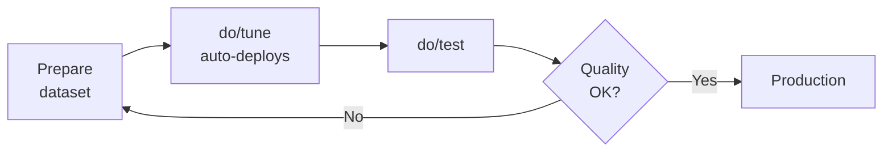

!!! tip "Need full control over your training code?"
    If you need to customize the training loop, use a different trainer, or bring your own training script, see [Custom Training](custom-training.md) — it provides the same lifecycle integration with full code control.

ML Container Creator includes a `do/tune` command that wraps SageMaker AI Managed Model Customization — a serverless fine-tuning capability that eliminates instance selection and container management. You provide a dataset and technique; SageMaker AI handles infrastructure, optimization, and produces a deployable model artifact that feeds directly back into your project's deployment lifecycle.

## Prerequisites

| Requirement | Details |
|---|---|
| Deployed endpoint | Endpoint must be `InService` (run `./do/deploy` first) |
| AWS credentials | Configured via `aws configure` or environment variables |
| Framework | `transformers` only |
| Deployment target | Any target except `batch-transform` |
| Bootstrapped account | Run `ml-container-creator bootstrap` to provision IAM permissions and tune S3 bucket |
| Python SDK | `sagemaker-core>=1.0.0` — install via `uv pip install -r requirements.txt` |

!!! note "Supported Models Only"
    `do/tune` works with models in the Supported Model Catalog. If your model isn't supported, the script will tell you which models are available and suggest `do/train` for custom training workflows.

## The Tune-Adapter-Deploy Feedback Loop

The fine-tuning workflow follows an iterative loop: prepare your dataset, tune the model, deploy the result, test it, and iterate until you're satisfied with quality.



### Step-by-step flow

1. **Prepare your dataset** — Format training data as JSONL matching the expected schema for your technique (see [Dataset Formats](#dataset-formats) below)

2. **Run `do/tune`** — Submit a managed customization job:
   ```bash
   ./do/tune --technique sft --dataset s3://my-bucket/train.jsonl
   ```

3. **Adapter automatically deployed** — When `do/tune` completes a LoRA job, it automatically:
   1. Stages adapter weights to S3 via a Processing Job
   2. Deploys the adapter as an inference component on your endpoint
   3. Registers the adapter in the deployment Model Package Group

   The auto-deployed adapter is named `tuned-<technique>-<dataset-slug>` (e.g. `tuned-sft-alpaca`).

   !!! tip "Skip auto-deployment"
       Pass `--no-register` to skip this automatic flow and manage adapters manually:
       ```bash
       ./do/tune --technique sft --dataset ... --no-register
       # Then deploy manually when ready:
       ./do/adapter add my-adapter --from-tune sft
       ```

   For **full merged model** output (`--training-type full-rank`), there is no auto-deploy.
   Run manually after the job completes:
   ```bash
   ./do/add-ic tuned-v1 --from-tune
   ```

4. **Test the result** — Verify the fine-tuned model behaves as expected:
   ```bash
   ./do/test
   ```

5. **Iterate** — If quality isn't satisfactory, adjust your dataset or hyperparameters and re-run `do/tune`. Each technique tracks its own state independently, so you can experiment with SFT and DPO in parallel without interference.

## How Output Feeds Into Deployment

When `do/tune` completes, it stores the output artifact path in `do/config` and detects the output type based on the training type used:

| Training Type | Output Type | Config Variable | Deployment Command |
|---|---|---|---|
| `lora` (default) | LoRA adapter weights | `TUNE_ADAPTER_PATH_<TECHNIQUE>` | `do/adapter add --from-tune` |
| `full-rank` | Full merged model | `TUNE_MODEL_PATH_<TECHNIQUE>` | `do/add-ic --from-tune` |

The `--from-tune` flag reads the output path from `do/config` automatically — no need to copy S3 URIs manually.

By default, `--from-tune` stages adapter weights via a **SageMaker Processing Job** (no local disk usage). Use `--local` to download and package locally instead.

### Adapter output (LoRA)

```bash
# Use the latest tune output (any technique)
./do/adapter add tuned-sft --from-tune

# Use a specific technique's output
./do/adapter add tuned-sft --from-tune sft

# Or pass the S3 path explicitly
./do/adapter add tuned-sft --weights s3://mlcc-tune-123456789012-us-east-1/output/adapter.tar.gz

# Stage locally instead of via Processing Job
./do/adapter add tuned-sft --from-tune --local
```

### Full model output

```bash
# Deploy as a new inference component
./do/add-ic tuned-v1 --from-tune

# Or pass the S3 path explicitly
./do/add-ic tuned-v1 --model-data s3://mlcc-tune-123456789012-us-east-1/output/model.tar.gz

# Replace the current base model
./do/deploy --force-ic --model-data s3://mlcc-tune-123456789012-us-east-1/output/model.tar.gz
```

### Multiple techniques

Each technique's output is tracked independently. You can tune with SFT, then tune with DPO, and deploy either result:

```bash
# Tune with SFT
./do/tune --technique sft --dataset s3://my-bucket/sft-data.jsonl

# Tune with DPO (doesn't affect SFT output)
./do/tune --technique dpo --dataset s3://my-bucket/dpo-data.jsonl

# Deploy the SFT adapter
./do/adapter add tuned-sft --from-tune sft

# Or deploy the DPO adapter instead
./do/adapter add tuned-dpo --from-tune dpo
```

## Supported Models

The following model families support managed customization via `do/tune`:

| Provider | Model Family | Sizes | Techniques |
|---|---|---|---|
| Alibaba | Qwen 2.5 | 7B, 14B, 32B, 72B | SFT, DPO, RLAIF, RLVR |
| Alibaba | Qwen 3 | 0.6B, 1.7B, 4B, 8B, 14B, 32B | SFT, DPO, RLAIF, RLVR |
| Alibaba | Qwen 3.5 (VLM) | 4B, 9B, 27B | SFT, RLAIF, RLVR |
| Alibaba | Qwen 3.6 (VLM) | 27B | SFT, RLAIF, RLVR |
| DeepSeek | R1 Distill (Llama) | 8B, 70B | SFT, DPO, RLAIF, RLVR |
| DeepSeek | R1 Distill (Qwen) | 1.5B, 7B, 14B, 32B | SFT, DPO, RLAIF, RLVR |
| Meta | Llama 3.1 Instruct | 8B | SFT, DPO, RLAIF, RLVR |
| Meta | Llama 3.2 Instruct | 1B, 3B | SFT, DPO, RLAIF, RLVR |
| Meta | Llama 3.3 Instruct | 70B | SFT, DPO, RLAIF, RLVR |
| OpenAI | GPT-OSS | 20B, 120B | SFT, DPO, RLAIF, RLVR |

**26 models total** across 10 families. VLM (Vision-Language) models support SFT, RLAIF, and RLVR but not DPO.

View the full catalog at any time:

```bash
./do/tune --list-models
```

### Unsupported model behavior

If your configured model is not in the Supported Model Catalog, `do/tune` exits with a clear message:

```text
❌ Model "my-custom-model-7b" is not yet supported for managed customization.

   Supported model families:
   • Alibaba Qwen 2.5 / Qwen 3 / Qwen 3.5 (VLM) / Qwen 3.6 (VLM)
   • DeepSeek R1 Distill
   • Meta Llama 3.1 / 3.2 / 3.3
   • OpenAI GPT-OSS

   For custom training workflows, use do/train (coming in a future release).
```

The script validates your model at runtime against the catalog, so catalog updates take effect without regenerating your project.

## Dataset Management

### Listing datasets

!!! warning "`do/tune --list-datasets` is deprecated"
    Dataset management is now centralized under `do/register dataset` (BL092).
    `do/tune --list-datasets` prints a pointer and exits — it no longer lists
    datasets. Use `do/register dataset --list` instead.

```bash
# List registered datasets (from the S3 sidecar registry)
./do/register dataset --list
```

Datasets are indexed by an **S3 sidecar** — a JSON metadata object stored beside
the data in the MLCC Core bucket at `s3://<CORE_BUCKET>/datasets/<name>/_dataset.json`.
The sidecar is the source of truth for versioning, content hashes, and `@v<N>`
pinning. Because it lives in S3 (not on your laptop), the registry is durable and
shared across machines and teammates who use the same Core bucket.

!!! note "Local registry removed"
    Earlier versions cached dataset metadata in `~/.ml-container-creator/datasets.json`.
    That local index has been removed (hard cutover) — a pre-existing file is
    ignored. All dataset metadata now lives in the S3 sidecar.

### Row count

When you register a dataset without specifying `--row-count`, MCC automatically counts rows by streaming the S3 file:

- **jsonl / ndjson** — counts newlines
- **csv / tsv** — counts newlines minus 1 (header)
- **parquet** — reads footer metadata (no full file read)

Row count is non-fatal — if the format is unsupported or S3 access fails, registration proceeds with `row_count: null`.

### Technique guardrail

If you try to use a dataset registered for a different technique (e.g., an SFT dataset for DPO tuning), `do/tune` warns you:

```
⚠️  Dataset 'my-sft-dataset' was registered for technique 'sft'
    but you're using --technique dpo. Proceeding anyway.
```

The warning is non-blocking — tuning proceeds. In automated (`MLCC_AUTO_MODE=1`) environments, the mismatch causes an auto-decline with exit code 4 to prevent silent data mismatches in CI pipelines.

## Techniques

`do/tune` supports four customization techniques. Each technique requires a different dataset format and produces different training dynamics.

| Technique | Use Case | Dataset Format |
|---|---|---|
| **SFT** | Teach the model a specific style or task | Prompt/completion pairs |
| **DPO** | Align the model with human preferences | Prompt with chosen/rejected responses |
| **RLAIF** | Align using an AI judge | Prompts with reward prompt reference |
| **RLVR** | Align using code-based verification | Prompts with reward function Lambda |

Not all models support all techniques. Check what's available for your model:

```bash
./do/tune --list-models
```

### Training types

Each model+technique combination supports one or both training types:

- **`lora`** (default) — Produces lightweight LoRA adapter weights. Faster to train, smaller artifacts, deployed via `do/adapter add`.
- **`full-rank`** — Produces a full merged model. Longer training, larger artifacts, deployed via `do/add-ic`.

```bash
# LoRA adapter (default)
./do/tune --technique sft --dataset s3://my-bucket/train.jsonl

# Full-rank fine-tuning
./do/tune --technique sft --dataset s3://my-bucket/train.jsonl --training-type full-rank
```

## Dataset Formats

Datasets must be in JSONL format (one JSON object per line). The expected schema depends on the technique and model family. The script validates the first 10 lines of your dataset before submitting the job.

### SFT (Supervised Fine-Tuning)

Each line contains a prompt and the desired completion:

```jsonl
{"prompt": "What is the capital of France?", "completion": "The capital of France is Paris."}
{"prompt": "Summarize photosynthesis in one sentence.", "completion": "Photosynthesis converts sunlight, water, and CO2 into glucose and oxygen."}
{"prompt": "Write a haiku about coding.", "completion": "Bugs in the midnight\nStack traces illuminate\nCoffee grows colder"}
```

**Required keys**: `prompt` (string), `completion` (string)

### DPO (Direct Preference Optimization)

Each line contains a prompt with a preferred ("chosen") and dispreferred ("rejected") response:

```jsonl
{"prompt": "Explain quantum computing", "chosen": "Quantum computing leverages quantum mechanical phenomena like superposition and entanglement to process information. Unlike classical bits that are 0 or 1, quantum bits (qubits) can exist in multiple states simultaneously.", "rejected": "Computers are really fast these days."}
{"prompt": "What causes rain?", "chosen": "Rain forms when water vapor in the atmosphere condenses into droplets heavy enough to fall due to gravity.", "rejected": "The sky cries sometimes."}
```

**Required keys**: `prompt` (string), `chosen` (string), `rejected` (string)

### RLVR (Reinforcement Learning with Verifiable Rewards)

Each line contains a prompt (as a message array) and a reference to a Lambda function that scores the model's output:

```jsonl
{"prompt": [{"role": "user", "content": "Solve: 2 + 2"}], "reward_model": "arn:aws:lambda:us-east-1:123456789012:function:math-verifier"}
{"prompt": [{"role": "user", "content": "Write a function that reverses a string in Python"}], "reward_model": "arn:aws:lambda:us-east-1:123456789012:function:code-verifier"}
```

**Required keys**: `prompt` (array of message objects), `reward_model` (string — Lambda ARN)

Use the `--reward-function` flag to specify the Lambda ARN:

```bash
./do/tune --technique rlvr \
  --dataset s3://my-bucket/prompts.jsonl \
  --reward-function arn:aws:lambda:us-east-1:123456789012:function:my-reward
```

### RLAIF (Reinforcement Learning from AI Feedback)

Same format as RLVR, but uses a reward prompt (an LLM judge) instead of a Lambda function:

```jsonl
{"prompt": [{"role": "user", "content": "Explain gravity to a 5-year-old"}], "reward_model": "s3://my-bucket/reward-prompts/clarity-judge.txt"}
{"prompt": [{"role": "user", "content": "Write a professional email declining a meeting"}], "reward_model": "s3://my-bucket/reward-prompts/tone-judge.txt"}
```

**Required keys**: `prompt` (array of message objects), `reward_model` (string — S3 URI to reward prompt)

Use the `--reward-prompt` flag to specify the reward prompt location:

```bash
./do/tune --technique rlaif \
  --dataset s3://my-bucket/prompts.jsonl \
  --reward-prompt s3://my-bucket/reward-prompts/clarity-judge.txt
```

### Model-specific formats

Some model families may expect a different format (e.g., Converse format). The Supported Model Catalog encodes the expected schema per model family and technique. If your model requires a non-default format, the validation error message will show the expected schema.

### Dataset sources

Datasets can be provided from two sources:

```bash
# From S3
./do/tune --technique sft --dataset s3://my-bucket/path/to/train.jsonl

# By registered name (stage + register once via do/register dataset)
./do/tune --technique sft --dataset my-dataset
```

!!! warning "`do/tune --dataset hf://...` is no longer supported"
    HuggingFace staging has moved to `do/register dataset` (BL092). `do/tune`
    with an `hf://` reference hard-errors with migration guidance. Stage and
    register the dataset once, then tune by name:

    ```bash
    # 1. Stage + register the HuggingFace dataset (once)
    ./do/register dataset my-dataset --hf-id my-org/my-dataset --technique sft

    # 2. Tune by name
    ./do/tune --technique sft --dataset my-dataset
    ```

    Column-map, `?file=` selection, `--take`, and split resolution are all
    supported by `do/register dataset` (the QoL helpers are shared). If the
    dataset requires authentication, set `HF_TOKEN` or configure it via
    `do/secrets`.

### Dataset registry

MCC indexes datasets with an **S3 sidecar** for reproducible tuning workflows.

#### Architecture

| Tier | Location | Purpose |
|------|----------|---------|
| **S3 sidecar** (source of truth) | `s3://<CORE_BUCKET>/datasets/<name>/_dataset.json` | Version tracking, content hashes, custom metadata, name resolution |
| **SageMaker AI Registry Hub** (supplementary, deferred) | SageMaker Hub (`mlcc-registry-{accountId}`) | Cross-account discoverability, Studio visibility |

The sidecar is populated automatically by `do/register dataset` and is the
source of truth for versioning and `@v<N>` pinning. It sits beside the dataset
bytes (which land at `s3://<CORE_BUCKET>/datasets/<name>/`), so the registry is
durable and shared across machines. Hub integration is preserved but deferred to
a later phase.

!!! note "Console Import Not Supported"
    The SageMaker Studio console's dataset import UI has a known schema validation
    bug (injects internal session properties). Always register datasets via
    `do/register dataset` or the SDK — not the console.

#### Using registered datasets

```bash
# List all registered datasets
./do/register dataset --list

# Use a registered dataset by name
./do/tune --technique sft --dataset alpaca-sft

# Pin a specific version for reproducibility
./do/tune --technique sft --dataset alpaca-sft@v1
```

The `--list` flag shows a table of available datasets:

```
📦 Registered datasets:

  NAME                     TECHNIQUE  LATEST     ROWS     S3 URI
  ----                     ---------  ------     ----     ------
  alpaca-sft               sft        1.0.0      1000     s3://mlcc-core-.../datasets/alpaca-sft/
  orca-dpo-pairs           dpo        1.1.0 (2v) 2500     s3://mlcc-core-.../datasets/orca-dpo-pairs/
```

#### Registration workflow

Register datasets explicitly with `do/register dataset`:

```bash
# From an existing S3 dataset — copied to s3://<CORE_BUCKET>/datasets/my-custom-data/
./do/register dataset my-custom-data \
  --s3-uri s3://my-bucket/datasets/custom.jsonl \
  --technique sft \
  --row-count 5000

# From HuggingFace — staged to s3://<CORE_BUCKET>/datasets/guanaco/ then registered
./do/register dataset guanaco \
  --hf-id timdettmers/openassistant-guanaco \
  --technique sft
```

You can also register the dataset used in the most recent tune job:

```bash
./do/register dataset --from-tune sft
```

The `--from-tune` flag auto-derives the dataset name (salted slug), S3 URI,
technique, and row count from the most recent tune job.

##### Custom metadata

Attach attribution, lineage, origination, and application metadata; these are
recorded under `customMetadata` in the S3 sidecar (unset fields are omitted):

```bash
./do/register dataset my-dataset \
  --s3-uri s3://my-bucket/data.jsonl --technique sft \
  --attribution "Acme Research" \
  --lineage "derived from open-orca v2, filtered" \
  --origination "hf://Open-Orca/OpenOrca@main" \
  --application "throughput-calibration"
```

!!! note "Canonical datasets location"
    `do/register dataset` moves the dataset into the canonical MLCC location on
    the `mlcc-core` bucket (`s3://<CORE_BUCKET>/datasets/<name>/`) before
    registering it — `--s3-uri` datasets are copied there, and `--hf-id`
    datasets are staged there. See
    [Deployment Registry](deployment-registry.md#dataset-registration) for the
    full flag reference.

#### Versioning

Datasets are versioned automatically using content hashes (S3 ETags):

| Action | Result |
|--------|--------|
| First `do/register dataset X --s3-uri ...` | Creates v1.0.0 with content hash |
| Same S3 content, same name | Skipped — "Dataset unchanged (v1)" |
| Different S3 content, same name | Creates v1.1.0 (content hash differs) |
| `--force` flag | Always creates new version regardless of hash |

Pin a specific version to ensure reproducibility across tune runs:

```bash
# Always use the original 1000-row version, even if a newer version exists
./do/tune --technique sft --dataset alpaca-sft@v1

# List all versions of a dataset
python3 do/.register_helper.py list-dataset-versions --name alpaca-sft --core-bucket <CORE_BUCKET>
```

!!! note "Versions live in the sidecar"
    Each registration appends a version entry to the dataset's S3 sidecar
    (`datasets/<name>/_dataset.json`). Registering unchanged content (same
    content hash) without `--force` is idempotent — no new version is created.

See [Deployment Registry](deployment-registry.md) for full `do/register dataset` documentation.

### File selection for multi-file datasets

!!! note "These HuggingFace conveniences now run under `do/register dataset`"
    File selection (`?file=`), column-map, `--take`, split resolution, and
    schema-divergence detection moved from `do/tune` to `do/register dataset`
    (BL092). The syntax below is identical — apply it when staging a HuggingFace
    dataset with `do/register dataset <name> --hf-id <org/name> ...`, then tune
    by the registered name. The examples that show `do/tune --dataset hf://...`
    illustrate the shared syntax; run them via `do/register dataset` instead.

Some HuggingFace datasets contain multiple files under the same split with different schemas. For example, `nvidia/When2Call` has files for tool-calling and general conversation — with different columns in each.

Without a file filter, the pipeline detects this mismatch and fails with a clear error showing each file's columns:

```text
❌ Schema divergence detected across files in nvidia/When2Call.

  📄 call_train_00000.parquet
     Columns: chosen, prompt, rejected
  📄 general_train_00000.parquet
     Columns: completion, prompt

  Files have different column sets. Use ?file=<pattern> to select compatible files:
    ./do/tune --technique dpo --dataset "hf://nvidia/When2Call?file=*call*"
```

Append `?file=<pattern>` to your `hf://` URI to filter:

!!! warning "Always quote URIs containing `?` or `*`"
    Bash interprets `?` as a single-character glob and `*` as a wildcard. Without quotes, your shell may expand these before `do/tune` sees them — causing silent argument corruption or "no matches found" errors.

```bash
# Glob pattern (fnmatch semantics)
./do/tune --technique dpo --dataset "hf://nvidia/When2Call?file=*call*"

# Substring match (no glob metacharacters)
./do/tune --technique sft --dataset "hf://my-org/my-dataset/train?file=sft_data"

# Specific file pattern
./do/tune --technique dpo --dataset "hf://my-org/my-dataset?file=train-0000?-*"
```

**Pattern matching rules:**

- If the pattern contains `*`, `?`, or `[` → glob match (fnmatch) against the full filename
- If the pattern is a plain string → substring match against the file's basename
- If no files match → the error lists all available files to help you choose

When only one file matches (or the dataset has a single file), schema divergence checking is skipped entirely.

### Auto-flatten (chat-format columns)

Many HuggingFace DPO datasets store `chosen`/`rejected` as chat-format message dicts rather than the flat strings SageMaker AI expects:

```json
{"prompt": "Explain AI", "chosen": {"role": "assistant", "content": "AI is..."}, "rejected": {"role": "assistant", "content": "Computers are fast"}}
```

The staging pipeline **automatically detects and flattens** these columns. No manual preprocessing needed:

```bash
# This just works — chat-format columns are flattened automatically
./do/tune --technique dpo --dataset "hf://nvidia/When2Call?file=*call*"
```

**What gets flattened:**

| Input Format | Strategy | Output |
|---|---|---|
| Single dict: `{"role": "assistant", "content": "text"}` | Extract `content` | `"text"` |
| Single-element list: `[{"role": "user", "content": "hi"}]` | Extract content | `"hi"` |
| Multi-message, same role | Concatenate with newlines | `"A\nB"` |
| Multi-message, mixed roles | Role-prefixed pairs | `"user: Q\nassistant: A"` |

**When it triggers:**

- Only on columns whose expected schema type is `"string"` (DPO: `chosen`, `rejected`; SFT: `completion`)
- RLAIF/RLVR `prompt` columns (type `"array"`) are **never** flattened — they legitimately contain message arrays
- Detection uses the first record only; the same strategy is applied uniformly to all records

**User feedback:**

When auto-flatten converts columns, you'll see:

```text
ℹ️  Auto-converted column 'chosen' from chat-format to string
    Format: extracted content field
ℹ️  Auto-converted column 'rejected' from chat-format to string
    Format: extracted content field
```

**Disabling auto-flatten:**

If you need to preserve the original column structure (e.g., for debugging or custom preprocessing):

```bash
./do/tune --technique dpo --dataset hf://my-org/my-dataset --no-transform
```

With `--no-transform` active, the pipeline still detects chat-format columns and logs what it found, but halts with an actionable error instead of converting:

```text
❌ Column 'chosen' contains chat-format data (detected: single_dict) but --no-transform is active.

   Remove --no-transform to enable automatic conversion:
   ./do/tune --technique dpo --dataset hf://my-org/my-dataset
```

!!! note "Pipeline ordering"
    The full staging pipeline runs in this order: **download** → **column rename** (`--column-map`) → **detect chat-format** → **flatten** → **type validation** → **write JSONL** → **upload to S3**. Column rename always happens before flatten, so `--column-map` and auto-flatten compose correctly.

## `do/tune` vs `do/train`

ML Container Creator offers two paths for model customization:

| | `do/tune` (Managed Serverless) | `do/train` (Bespoke Training) |
|---|---|---|
| **Status** | Available now | Coming in a future release |
| **Infrastructure** | Fully managed by SageMaker AI | You choose instance types and containers |
| **Supported models** | Models in the Supported Model Catalog | Any model |
| **Techniques** | SFT, DPO, RLAIF, RLVR | Any training script |
| **Configuration** | Minimal — dataset + technique | Full control over training code |
| **When to use** | Your model is supported and you want the fastest path | You need custom training logic or an unsupported model |

**Recommendation**: Start with `do/tune` if your model is in the Supported Model Catalog. It's the fastest path from dataset to deployed adapter with zero infrastructure management. Fall back to `do/train` when you need custom training logic or your model isn't supported.

## CLI Reference

### Synopsis

```bash
./do/tune --technique <technique> --dataset <source> [options]
./do/tune --status
./do/tune --list-models
./do/tune --help
```

### Required flags

| Flag | Values | Description |
|---|---|---|
| `--technique` | `sft`, `dpo`, `rlaif`, `rlvr` | Customization technique to apply |
| `--dataset` | S3 URI (`s3://bucket/path.jsonl`) or a registered dataset name (optionally `@v<N>`-pinned) | Training dataset location. `hf://` references are not accepted here — stage them with `do/register dataset --hf-id` first. |

### Training type

| Flag | Values | Default | Description |
|---|---|---|---|
| `--training-type` | `lora`, `full-rank` | `lora` | Whether to produce LoRA adapter weights or a full merged model |

### Hyperparameter overrides (all optional)

| Flag | Type | Description |
|---|---|---|
| `--epochs` | integer | Number of training epochs (typically 1–5) |
| `--learning-rate` | float | Learning rate (e.g., `2e-4`) |
| `--max-seq-length` | integer | Maximum sequence length in tokens |
| `--lora-rank` | integer | LoRA rank (e.g., 16, 32, 64). Only applies when `--training-type lora` |
| `--lora-alpha` | integer | LoRA alpha scaling factor. Only applies when `--training-type lora` |
| `--batch-size` | integer | Global batch size |

### Dataset options

| Flag | Type | Description |
|---|---|---|
| `--column-map` | string | Rename source columns to target columns (e.g., `"input:prompt,output:completion"`) |
| `--no-transform` | flag | Disable auto-flatten — halt with error if chat-format data is detected |

### Evaluator flags (RLVR/RLAIF only)

| Flag | Type | Description |
|---|---|---|
| `--reward-function` | Lambda ARN | ARN of the reward function Lambda (RLVR) |
| `--reward-prompt` | S3 URI | S3 path to reward prompt file (RLAIF) |

### Model and infrastructure overrides

| Flag | Type | Description |
|---|---|---|
| `--model` | JumpStart model ID | Override the model to customize (defaults to `MODEL_ID` from `do/config`) |
| `--output-bucket` | S3 bucket name | Override the output bucket (defaults to `TUNE_S3_BUCKET`) |
| `--role` | IAM role ARN | Override the execution role |

### Job control

| Flag | Description |
|---|---|
| `--force` | Force a new job even if a previous job exists for this technique |
| `--no-wait` | Submit the job and exit immediately without polling |
| `--status` | Show status of all tracked tune jobs |
| `--dry-run` | Validate inputs and show what would be submitted without creating a job |
| `--list-models` | Print the Supported Model Catalog and exit |
| `--help` | Show usage information |

## Examples

### Basic SFT with S3 dataset

```bash
./do/tune --technique sft --dataset s3://my-bucket/train.jsonl
```

### DPO with Hugging Face dataset and custom learning rate

```bash
./do/tune --technique dpo --dataset hf://my-org/preference-data --learning-rate 1e-5
```

### DPO with multi-file dataset (file selection + auto-flatten)

```bash
./do/tune --technique dpo --dataset "hf://nvidia/When2Call?file=*call*"
```

### Full-rank fine-tuning

```bash
./do/tune --technique sft --dataset s3://my-bucket/train.jsonl --training-type full-rank
```

### Override model (tune a different model than what's deployed)

```bash
./do/tune --technique sft --dataset s3://my-bucket/train.jsonl \
  --model meta-textgeneration-llama-3-3-70b-instruct
```

### RLVR with reward function

```bash
./do/tune --technique rlvr \
  --dataset s3://my-bucket/prompts.jsonl \
  --reward-function arn:aws:lambda:us-east-1:123456789012:function:my-reward
```

### Dry run (validate without submitting)

```bash
./do/tune --technique sft --dataset s3://my-bucket/train.jsonl --dry-run
```

### Force re-run after a failed job

```bash
./do/tune --technique sft --dataset s3://my-bucket/train.jsonl --force
```

## Idempotency

Re-running `do/tune` with the same technique resumes or reports on the existing job rather than creating a duplicate:

- **Job in progress** — Polls and displays progress until completion
- **Job completed** — Displays results and next-step commands
- **Job failed** — Displays the failure reason and suggests `--force` to retry

Use `--force` to explicitly start a new job, overriding the previous one for that technique.

## MLflow Integration

When an MLflow tracking server is configured in your SageMaker AI domain, customization jobs automatically log training metrics, hyperparameters, and model artifacts to MLflow. The script displays the MLflow experiment URL after job submission.

If no MLflow server is configured, the script proceeds without tracking and prints a note suggesting MLflow setup for experiment comparison.

## Future: Bedrock Custom Model Import

The output artifacts from managed customization are compatible with [Amazon Bedrock Custom Model Import](https://docs.aws.amazon.com/bedrock/latest/userguide/model-customization-import-model.html). This deployment path — importing your fine-tuned model into Bedrock for serverless inference — is planned for a future release. The current workflow deploys via SageMaker AI endpoints using `do/adapter add` or `do/add-ic`.

## Troubleshooting

### "Model not yet supported"

Your configured model isn't in the Supported Model Catalog. Run `./do/tune --list-models` to see available models, or use `--model` to override with a supported model ID.

### Dataset validation fails

The script validates the first 10 lines of your dataset. Check that:

- The file is valid JSONL (one JSON object per line)
- Each line contains the required keys for your technique
- Values match the expected types (strings for SFT/DPO, arrays for RLVR/RLAIF prompts)

The error message shows the first malformed line and the expected format.

### "Schema divergence detected across files"

Your HuggingFace dataset has files with different column sets. Use `?file=<pattern>` to select only the files matching your technique's schema. The error message shows each file's columns and suggests a pattern.

### "Column contains chat-format data but --no-transform is active"

You passed `--no-transform` but the dataset has chat-format columns that need flattening. Remove `--no-transform` to enable automatic conversion, or preprocess the data manually.

### "Technique not supported for this model"

Not all models support all techniques. Run `./do/tune --list-models` to see which techniques are available for your model.

### Job fails with AccessDenied

Run `ml-container-creator bootstrap` to provision the required IAM permissions. The bootstrap stack adds SageMaker AI training, model package, and MLflow permissions.

### Python SDK not installed

The `do/tune` script requires `sagemaker>=3.0.0` and several other Python packages. These are installed automatically when you run `npm install`. If you manage Python environments manually:

```bash
pip install -r requirements.txt
```

See [`requirements.txt`](https://github.com/awslabs/ml-container-creator/blob/main/requirements.txt) for the full list.
### Job failed — how to retry

When a job fails, the script displays the failure reason. Fix the underlying issue and re-run with `--force`:

```bash
./do/tune --technique sft --dataset s3://my-bucket/train.jsonl --force
```
