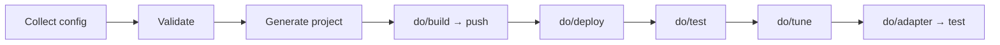
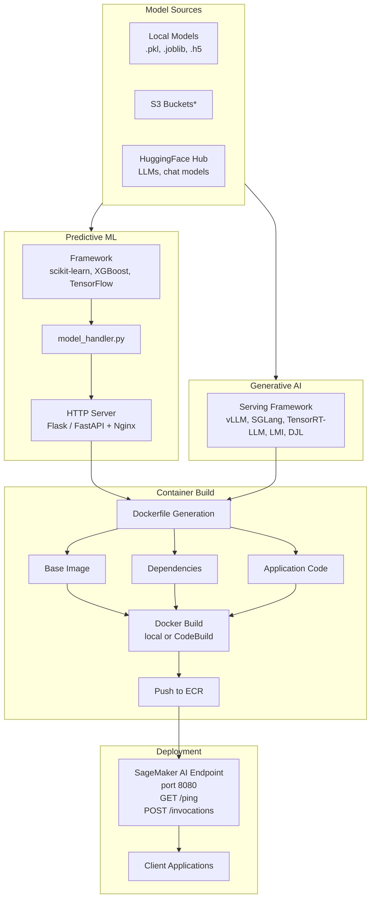

# How It Works

This guide describes how ML Container Creator (MCC) works: what decisions it captures, how it generates deployment assets, and how those assets get built and deployed. For a hands-on walkthrough, see the [Getting Started Guide](getting-started.md).

## The Three Decisions

Deploying a model to SageMaker AI requires three interrelated decisions:

1. **Model selection** -- Where does the model come from and in what format?
2. **Model serving** -- Which framework handles inference requests?
3. **Model deployment** -- What instance type and deployment target?

Each decision influences the generated technical assets (Dockerfiles, serving code, deployment scripts). MCC captures all three through its prompt flow or CLI flags and produces a complete, buildable project.

## Generator Flow

MCC collects configuration, validates it, and generates a project directory with all the files needed to build, push, and deploy a container.



Configuration can come from interactive prompts, CLI flags, environment variables, config files, or MCP servers. These sources are merged in a strict precedence order -- see the [Configuration Guide](configuration.md) for the full precedence chain.

In interactive mode, the generator walks through five phases: model selection (deployment config + model name), serving configuration (target, profile, base image), infrastructure (region, instance type — derived from model via the instance-sizer), details (framework version, modules), and project settings (name, destination). The instance type is a derived value — once the model and base image are known, the instance-sizer computes VRAM requirements and recommends compatible instances automatically. In non-interactive mode (`--skip-prompts`), all values come from CLI flags or config files.

The [Getting Started Guide](getting-started.md) has complete walkthroughs for both a predictive model (sklearn + Flask) and an LLM (SGLang), including the exact CLI commands and generated project structures.

!!! tip "Supported Models"
    MCC validates 22 model + instance combinations end-to-end through the full lifecycle (build → deploy → test → tune → adapter → test). If your model is in the [Supported Models](supported-models.md) catalog, you're on a tested, proven path.

## Models

MCC handles two categories of models with fundamentally different container architectures.

| Aspect | Predictive ML | Generative AI |
|--------|---------------|---------------|
| **Examples** | sklearn classifiers, XGBoost regressors, TensorFlow CNNs | Llama, Mistral, GPT |
| **Model size** | KB -- MB | GB -- hundreds of GB |
| **Storage** | Local files bundled in container at build time | Downloaded from HuggingFace Hub at runtime |
| **Instance types** | CPU-optimized (ml.m5, ml.m6g) | GPU-required (ml.g5, ml.g6) |
| **Inference latency** | Milliseconds | Seconds |

### Predictive Models

Predictive models are small models for classification, regression, and similar tasks. MCC requires a model format selection so the model loader knows which file to look for at `/opt/ml/model/`.

#### Supported frameworks

--8<-- "ml-frameworks-table.md"

#### Loading models into the container

**Local copy** is the default strategy. A model file from your local filesystem is copied into the container at build time using a Dockerfile `COPY` directive. When bringing your own model, uncomment and edit this line in the generated Dockerfile:

```dockerfile
# COPY your_model_files /opt/ml/model/
```

The target directory must be `/opt/ml/model/` for SageMaker AI compatibility.

**Sample model.** For testing without a real model, MCC can train a sample model on the [Abalone dataset](https://archive.ics.uci.edu/dataset/1/abalone) using the selected framework. The sample model is automatically copied into the container. This is for validating the build and deployment pipeline, not for production use.

### Generative Models

Generative models (LLMs) are specified by HuggingFace model ID at generation time. MCC does not require a model format -- the serving framework handles downloading and loading the model into GPU memory. For supported models, you can fine-tune with `do/tune` and deploy the resulting adapter or full model — see the [Fine-Tuning Guide](fine-tuning.md) for the full workflow.

```json
{
  "framework": "transformers",
  "modelName": "mistralai/Mistral-7B-Instruct-v0.2",
  "modelServer": "sglang"
}
```

#### HuggingFace authentication

Some models are gated and require a HuggingFace API token. You can provide it via:

- CLI flag: `--hf-token="hf_..."` or `--hf-token='$HF_TOKEN'`
- Environment variable: `export HF_TOKEN="hf_..."` then reference `$HF_TOKEN`
- Interactive prompt (when selecting a custom model)
- Config file: `"hfToken": "$HF_TOKEN"`

See the [Configuration Guide](configuration.md#huggingface-authentication) for details and security best practices.

#### HuggingFace API lookups

When a model ID is specified, MCC validates the model by querying HuggingFace endpoints:

| Endpoint | Purpose |
|----------|---------|
| `GET /api/models/{modelId}` | Validate model exists, get metadata |
| `GET /{modelId}/resolve/main/tokenizer_config.json` | Extract chat template |
| `GET /{modelId}/resolve/main/config.json` | Get model architecture details |

These calls time out after 5 seconds and handle 404/429 errors gracefully. Use `--offline` to skip them entirely.

## Serving Frameworks

MCC generates different container architectures depending on the serving framework.

### HTTP servers (predictive models)

Predictive models need an HTTP layer to expose the SageMaker AI-required `/ping` and `/invocations` endpoints on port 8080. MCC generates a model handler (`model_handler.py`) for inference logic and pairs it with a web server and Nginx reverse proxy.

| Web Server | Description |
|------------|-------------|
| Flask | Lightweight Python web framework, served via Gunicorn |
| FastAPI | Modern async framework with automatic OpenAPI docs |

### LLM servers (generative models)

LLM serving frameworks handle both model loading and HTTP serving. Some require an Nginx reverse proxy for SageMaker AI compatibility.

--8<-- "ai-frameworks-table.md"

### Triton Inference Server

For multi-framework, high-throughput serving, MCC generates Triton-compatible projects with model repository layouts and `config.pbtxt` files. Supported backends: FIL, ONNX Runtime, TensorFlow, PyTorch, vLLM, TensorRT-LLM, and Python.

## Container Building

MCC generates Docker containers that package the base image, application code, configuration files, and dependencies. For predictive models, model artifacts are included in the image. For generative models, the container downloads models from HuggingFace Hub at runtime.

### Local builds

Run `./do/build` to create the image locally and `./do/push` to upload it to Amazon ECR. You can test locally with `./do/run` before pushing.

Locally built containers may produce `exec` errors if deployed onto a different architecture (e.g., building on ARM, deploying on x86). Use the `--platform` flag for Docker, or use CodeBuild for production builds.

### AWS CodeBuild

For CI/CD workflows, `./do/submit` creates a CodeBuild project that builds the image and pushes it to ECR in a single step. MCC generates the IAM policy document and `buildspec.yml` automatically. This is the preferred method for production containers, especially for large LLM images where fast network access to base image registries matters.

## Endpoint Deployment

Once a container is built and pushed to ECR, `./do/deploy` provisions the deployment target. MCC supports two targets:

- **Managed Inference** (`managed-inference`): SageMaker AI real-time endpoints via the Inference Components API. This is the default.
- **HyperPod EKS** (`hyperpod-eks`): Kubernetes deployment on existing SageMaker AI HyperPod clusters.

After deployment, `./do/test` validates the endpoint, `./do/logs` tails logs, and `./do/clean` tears down resources.

See [Deployment & Inference](deployments.md) for the full lifecycle script reference and target-specific details.

## Architecture Overview

The following diagram shows the end-to-end flow from model source through deployment. Items marked with * are on the roadmap.


