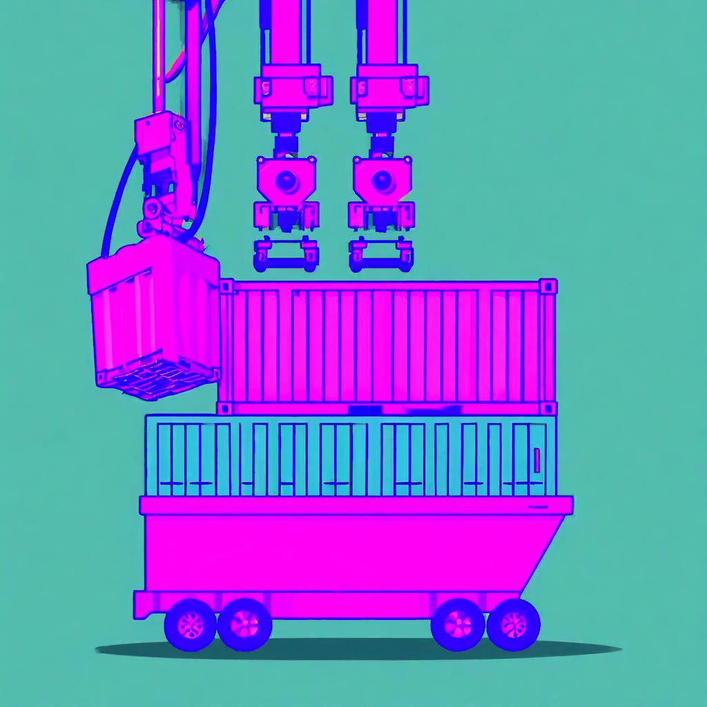

# ML Container Creator

<div align="center">
  
  <p><strong>The BYOC toolkit for Amazon SageMaker AI</strong></p>
  <p>From model selection to endpoint in one workflow. Deploy, tune, and iterate — all from one CLI.</p>
</div>

---

## Deploy a Model in 60 Seconds

```bash
# Install (or use npx @aws/ml-container-creator)
npm install -g @aws/ml-container-creator

# Generate a project
ml-container-creator my-llm \
  --deployment-config=transformers-vllm \
  --model-name=Qwen/Qwen3-4B \
  --instance-type=ml.g5.xlarge \
  --skip-prompts

# Build, deploy, and test
cd my-llm
./do/build && ./do/push && ./do/deploy && ./do/test
```

Then iterate — fine-tune and hot-swap a LoRA adapter without restarting:

```bash
./do/tune --technique sft --dataset s3://my-bucket/train.jsonl
./do/adapter add tuned-sft --from-tune
./do/test    # Verify the adapter works
```

For full control over the training code, see [Custom Training](custom-training.md) (`do/train`).

See [Getting Started](getting-started.md) for the full walkthrough with prerequisites.

---

## Why MCC?

Teams spend 2–5 days writing Dockerfiles, serve scripts, and deploy scripts before they can even test inference. Then they repeat that work for every model, every framework, every deployment target.

MCC eliminates the boilerplate. You select a model and a framework — MCC generates a complete, deployable project with lifecycle scripts that cover the entire iteration loop.

**You own every line of generated code.** No runtime dependency. No lock-in. MCC is a code generator, not a framework.

---

## What You Get

Every generated project includes 20+ `do/` lifecycle scripts:

| Stage | Scripts | What They Do |
|---|---|---|
| **Build** | `build`, `push`, `submit` | Container image → Amazon ECR |
| **Deploy** | `deploy`, `add-ic`, `status` | Model → SageMaker AI endpoint |
| **Test** | `test`, `validate`, `benchmark` | Inference validation + performance |
| **Iterate** | `tune`, `adapter`, `train` | Fine-tune + hot-swap adapters |
| **Operate** | `logs`, `clean`, `register`, `ci`, `export` | Monitoring + teardown + CI |

Every project includes 20+ scripts total. See [Deployment & Inference](deployments.md) for the full script reference.

---

## Supported Configurations

### Serving Architectures

| Architecture | Backends | Use Case |
|---|---|---|
| **Transformers** | vLLM, SGLang, TensorRT-LLM, LMI, DJL | Large language models |
| **HTTP** | Flask, FastAPI | Predictive models (sklearn, XGBoost, TensorFlow) |
| **Triton** | FIL, ONNX Runtime, TensorFlow, PyTorch, vLLM, TensorRT-LLM, Python | Multi-framework serving |
| **Diffusors** | vLLM | Image generation |

### Deployment Targets

| Target | Description |
|---|---|
| **Managed Inference** | SageMaker AI real-time endpoints |
| **Async Inference** | S3-based async processing with SNS notifications |
| **Batch Transform** | S3-to-S3 dataset processing |
| **HyperPod EKS** | Kubernetes on SageMaker AI HyperPod clusters |

### Validated Models

MCC validates 22+ model + instance combinations end-to-end — from generation through fine-tuning and adapter serving. If your configuration is in the [Supported Models](supported-models.md) catalog, every lifecycle step has been proven.

Models NOT in the catalog still work — MCC generates projects for any HuggingFace model. You take on validation yourself.

---

## Intelligent Defaults (MCP Servers)

Six bundled [Model Context Protocol](mcp-configuration.md) servers recommend configurations automatically:

| Server | What It Does |
|---|---|
| **instance-sizer** | Recommends instance types based on model size + framework |
| **region-picker** | Finds regions with availability |
| **base-image-picker** | Selects optimal base image for CUDA version |
| **model-picker** | Discovers models from HuggingFace, S3, Marketplace |
| **hyperpod-cluster-picker** | Lists available HyperPod EKS clusters |
| **endpoint-picker** | Discovers existing endpoints for attachment |

MCP is optional — MCC works without it. MCP just makes the defaults smarter.

---

## Documentation

| Section | For... |
|---|---|
| **[Getting Started](getting-started.md)** | First-time users — install, bootstrap, deploy your first model |
| **[Supported Models](supported-models.md)** | Check if your model is validated end-to-end |
| **[Configuration](configuration.md)** | CLI flags, env vars, config files, MCP, precedence |
| **[Deployment & Inference](deployments.md)** | All deployment targets + full lifecycle scripts reference |
| **[Fine-Tuning](fine-tuning.md)** | Managed tuning, LoRA adapters, the iterate loop |
| **[MCP Servers](mcp-configuration.md)** | Configure and extend the intelligent defaults |
| **[CI Integration](ci-integration.md)** | Automated E2E validation + regression detection |
| **[Benchmarking](benchmarking.md)** | Performance measurement with SageMaker AI Benchmarking |
| **[Examples](EXAMPLES.md)** | Copy-paste walkthroughs for every architecture |
| **[Troubleshooting](TROUBLESHOOTING.md)** | Common issues and solutions |
| **[Contributing](CONTRIBUTING.md)** | Development setup + contribution workflow |
| **[Command Generator](command-generator.md)** | Interactive tool to build deployment commands |

---

## Links

- [GitHub Repository](https://github.com/awslabs/ml-container-creator)
- [npm Package](https://www.npmjs.com/package/@aws/ml-container-creator)
- [Report an Issue](https://github.com/awslabs/ml-container-creator/issues)
- [Discussions](https://github.com/awslabs/ml-container-creator/discussions)

---

## License

Apache-2.0. See [CONTRIBUTING](https://github.com/awslabs/ml-container-creator/blob/main/CONTRIBUTING.md#security-issue-notifications) for security issue reporting.
