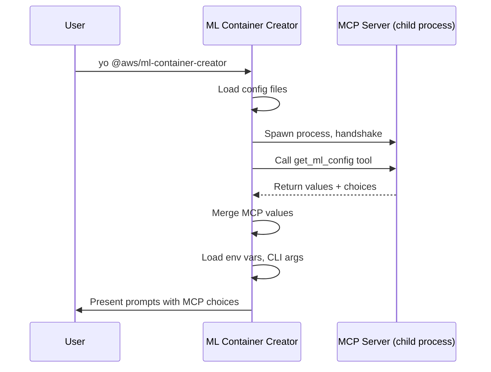

# MCP Servers

ML Container Creator supports [Model Context Protocol](https://modelcontextprotocol.io/) (MCP) as a configuration source. MCP servers provide configuration values -- like recommended instance types or AWS regions -- that the generator merges into its configuration chain during project generation.

## How It Works

MCP is an open protocol that standardizes how applications communicate with external tool servers. In ML Container Creator, MCP serves as a configuration provider protocol: the generator spawns MCP servers as child processes, queries them for parameter values over stdio, and merges the results into the configuration. No LLM is in the loop -- the generator programmatically queries servers and merges results. The servers themselves are fully MCP-compliant, so any MCP client (Claude, Kiro, or your own) can also connect to them.



MCP sits at priority 4 in the [configuration precedence chain](configuration.md#precedence) -- below CLI options, arguments, and environment variables, but above config files and defaults.

MCP is entirely optional. If a server is not configured, unreachable, times out (default 10s), or returns errors, the generator logs a warning and continues without MCP values. Prompts fall back to their default choices.

## Eligible Parameters

Only parameters with unbounded value spaces are eligible for MCP:

| Parameter | MCP Eligible | Reason |
|-----------|:---:|--------|
| `instanceType` | yes | Open-ended set of SageMaker instance types |
| `awsRegion` | yes | AWS adds new regions over time |
| `awsRoleArn` | yes | Arbitrary IAM role ARNs |
| `framework` | no | Fixed set: sklearn, xgboost, tensorflow, transformers |
| `modelServer` | no | Fixed set: flask, fastapi, vllm, sglang, etc. |
| All others | no | Bounded value spaces |

MCP servers can return values for any parameter, but the generator silently discards values for ineligible parameters.

## Managing MCP Servers

### Initialize All Bundled Servers

```bash
yo @aws/ml-container-creator mcp init
```

Creates `config/mcp.json` with every bundled server pre-configured. Existing servers are preserved.

### Add a Server

```bash
yo @aws/ml-container-creator mcp add team-config -- node path/to/server.js
```

With environment variables and options:

```bash
yo @aws/ml-container-creator mcp add team-config -- npx -y @corp/mcp-config \
  -e TEAM_ID=ml-platform \
  --tool-name get_approved_config \
  --limit 5
```

The `mcp add` command registers a server in your config file. The server is spawned and queried later, when you run the generator.

### Add a Bundled Server

The generator ships with first-party MCP servers in the `servers/` directory:

```bash
yo @aws/ml-container-creator mcp add instance-recommender --bundled
```

Dependencies are installed automatically on first use.

### List, Inspect, Remove

```bash
yo @aws/ml-container-creator mcp list              # List configured servers
yo @aws/ml-container-creator mcp list --bundled     # List available bundled servers
yo @aws/ml-container-creator mcp get team-config    # Inspect a server
yo @aws/ml-container-creator mcp remove team-config # Remove a server
```

## Config File Format

MCP servers are configured under the `mcpServers` key in `config/mcp.json`:

```json
{
  "framework": "sklearn",
  "modelServer": "flask",
  "mcpServers": {
    "team-config": {
      "command": "node",
      "args": ["servers/instance-recommender/index.js"],
      "env": { "TEAM_ID": "ml-platform" },
      "toolName": "get_ml_config",
      "limit": 5
    }
  }
}
```

| Field | Type | Required | Default | Description |
|-------|------|:---:|---------|-------------|
| `command` | string | yes | -- | Executable to spawn |
| `args` | string[] | -- | `[]` | Command-line arguments |
| `env` | object | -- | `{}` | Additional environment variables |
| `toolName` | string | -- | `get_ml_config` | MCP tool to call |
| `limit` | integer | -- | `10` | Max choices per parameter |

When multiple servers are configured, they are queried in order. Later servers take precedence for conflicting values.

## Bundled Servers

### instance-recommender

Recommends SageMaker instance types based on the current framework. Traditional ML frameworks get CPU instance suggestions; transformer frameworks get GPU instances.

```bash
yo @aws/ml-container-creator mcp add instance-recommender --bundled
```

### region-picker

Suggests AWS regions based on a search term. Set `REGION_SEARCH` to filter by region code or location name (e.g., "europe", "tokyo", "us-west"). Without a search term, returns popular SageMaker regions.

```bash
yo @aws/ml-container-creator mcp add region-picker --bundled -e REGION_SEARCH=europe
```

## Smart Mode (Amazon Bedrock)

Both bundled servers support an optional smart mode that queries Amazon Bedrock for context-aware recommendations instead of returning static lists. Set `BEDROCK_SMART=true` in the server's environment to enable it. If the Bedrock call fails, the server falls back to static recommendations.

```bash
yo @aws/ml-container-creator mcp add instance-recommender --bundled \
  -e BEDROCK_SMART=true
```

### Configuration

| Environment Variable | Default | Description |
|---------------------|---------|-------------|
| `BEDROCK_SMART` | `false` | Enable Bedrock-powered recommendations |
| `BEDROCK_MODEL` | `global.anthropic.claude-sonnet-4-20250514-v1:0` | Bedrock model ID |
| `BEDROCK_REGION` | `us-east-1` | AWS region for Bedrock API calls |

The default model uses the global cross-region inference profile, which routes requests to the nearest available region. You can override this with any Bedrock model ID that supports the Messages API.

### Prerequisites

- AWS credentials configured (via environment, profile, or IAM role)
- Access to the specified Bedrock model enabled in your account

### IAM Permissions

The calling identity needs `bedrock:InvokeModel` on the inference profile:

```json
{
    "Effect": "Allow",
    "Action": "bedrock:InvokeModel",
    "Resource": "arn:aws:bedrock:*:*:inference-profile/global.anthropic.claude-sonnet-4-20250514-v1:0"
}
```

## Writing a Custom MCP Server

Any process that speaks the MCP protocol over stdio can serve as a configuration provider. Your server needs to:

1. Handle the MCP initialize handshake
2. Register a tool (default name: `get_ml_config`)
3. Accept `{ parameters, limit, context }` as tool input
4. Return `{ values, choices }` as a JSON text response

### Tool Input

```json
{
  "parameters": ["instanceType", "awsRoleArn", "awsRegion"],
  "limit": 10,
  "context": {
    "framework": "transformers",
    "modelServer": "vllm"
  }
}
```

- `parameters` -- which unbounded parameter names the generator is requesting
- `limit` -- maximum number of choices to return per parameter
- `context` -- current configuration state for informed recommendations

### Tool Response

```json
{
  "values": {
    "instanceType": "ml.g5.xlarge"
  },
  "choices": {
    "instanceType": [
      "ml.g5.xlarge",
      "ml.g5.2xlarge",
      "ml.g4dn.xlarge"
    ]
  }
}
```

- `values` -- recommended default value per parameter (merged into config)
- `choices` -- list of options per parameter (shown during prompting)

Both fields are optional. A server may return only values, only choices, or both.

### Example Server

```javascript
import { McpServer } from '@modelcontextprotocol/sdk/server/mcp.js'
import { StdioServerTransport } from '@modelcontextprotocol/sdk/server/stdio.js'
import { z } from 'zod'

const server = new McpServer({ name: 'my-config-server', version: '1.0.0' })

server.tool(
    'get_ml_config',
    'Returns ML configuration values',
    {
        parameters: z.array(z.string()),
        limit: z.number().int().positive().default(10),
        context: z.record(z.string(), z.any()).optional()
    },
    async ({ parameters, limit, context }) => {
        const values = {}
        const choices = {}

        // Your logic here — query a database, call an API, read a file, etc.

        return {
            content: [{
                type: 'text',
                text: JSON.stringify({ values, choices })
            }]
        }
    }
)

const transport = new StdioServerTransport()
await server.connect(transport)
```

Register it:

```bash
yo @aws/ml-container-creator mcp add my-server -- node path/to/my-server.js
```

See `servers/README.md` for the full directory structure and license requirements for bundled servers.
