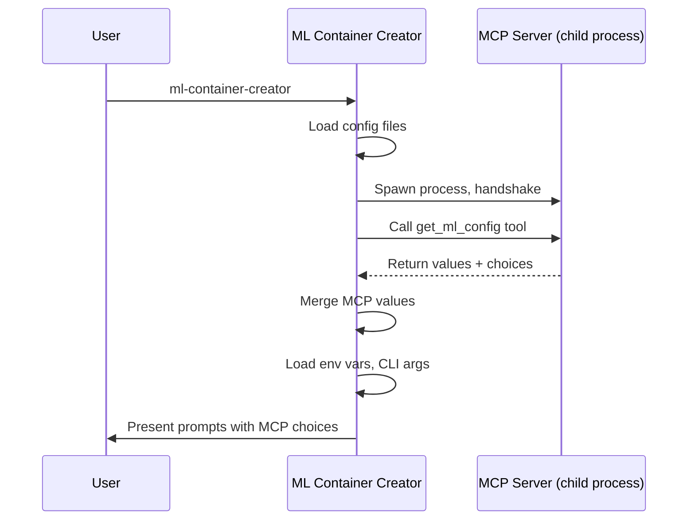

# MCP Servers

ML Container Creator supports [Model Context Protocol](https://modelcontextprotocol.io/) (MCP) as a configuration source. MCP servers provide configuration values -- like recommended instance types or AWS regions -- that the generator merges into its configuration chain during project generation.

## How It Works

MCP is an open protocol that standardizes how applications communicate with external tool servers. In ML Container Creator, MCP serves as a configuration provider protocol: the generator spawns MCP servers as child processes, queries them for parameter values over stdio, and merges the results into the configuration. No LLM is in the loop -- the generator programmatically queries servers and merges results. The servers themselves are fully MCP-compliant, so any MCP client (Claude, Kiro, or your own) can also connect to them.



MCP sits at priority 4 in the [configuration precedence chain](configuration.md#precedence) -- below CLI options, arguments, and environment variables, but above config files and defaults.

MCP is entirely optional. If a server is not configured, unreachable, times out (default 10s), or returns errors, the generator logs a warning and continues without MCP values. Prompts fall back to their default choices.

## Eligible Parameters

Only parameters with unbounded value spaces are eligible for MCP:

| Parameter | MCP Eligible | Reason |
|-----------|:---:|--------|
| `instanceType` | yes | Open-ended set of SageMaker AI instance types |
| `awsRegion` | yes | AWS adds new regions over time |
| `awsRoleArn` | yes | Arbitrary IAM role ARNs |
| `framework` | no | Fixed set: sklearn, xgboost, tensorflow, transformers |
| `modelServer` | no | Fixed set: flask, fastapi, vllm, sglang, etc. |
| All others | no | Bounded value spaces |

MCP servers can return values for any parameter, but the generator silently discards values for ineligible parameters.

## Managing MCP Servers

### Initialize All Bundled Servers

```bash
ml-container-creator mcp init
```

Creates `config/mcp.json` with every bundled server pre-configured. Existing servers are preserved.

### Add a Server

```bash
ml-container-creator mcp add team-config -- node path/to/server.js
```

With environment variables and options:

```bash
ml-container-creator mcp add team-config -- npx -y @corp/mcp-config \
  -e TEAM_ID=ml-platform \
  --tool-name get_approved_config \
  --limit 5
```

The `mcp add` command registers a server in your config file. The server is spawned and queried later, when you run the generator.

### Add a Bundled Server

The generator ships with first-party MCP servers in the `servers/` directory:

```bash
ml-container-creator mcp add instance-recommender --bundled
```

Dependencies are installed automatically on first use.

### List, Inspect, Remove

```bash
ml-container-creator mcp list              # List configured servers
ml-container-creator mcp list --bundled     # List available bundled servers
ml-container-creator mcp get team-config    # Inspect a server
ml-container-creator mcp remove team-config # Remove a server
```

## Config File Format

MCP servers are configured under the `mcpServers` key in `config/mcp.json`:

```json
{
  "framework": "sklearn",
  "modelServer": "flask",
  "mcpServers": {
    "team-config": {
      "command": "node",
      "args": ["servers/instance-recommender/index.js"],
      "env": { "TEAM_ID": "ml-platform" },
      "toolName": "get_ml_config",
      "limit": 5
    }
  }
}
```

| Field | Type | Required | Default | Description |
|-------|------|:---:|---------|-------------|
| `command` | string | yes | -- | Executable to spawn |
| `args` | string[] | -- | `[]` | Command-line arguments |
| `env` | object | -- | `{}` | Additional environment variables |
| `toolName` | string | -- | `get_ml_config` | MCP tool to call |
| `limit` | integer | -- | `10` | Max choices per parameter |

When multiple servers are configured, they are queried in order. Later servers take precedence for conflicting values.

## Bundled Servers

### instance-sizer

The single authority for all instance-related recommendations. Estimates VRAM requirements from model metadata, performs search/tag-based filtering, and returns filtered, ranked SageMaker AI instance recommendations. Supports both VRAM-driven sizing (when a model name is provided) and tag-based search (when an `instanceSearch` query is provided).

```bash
ml-container-creator mcp add instance-sizer --bundled
```

The instance-sizer accepts optional context including CUDA version constraints (from the base image), serving profile ENV overrides (for accurate KV cache estimation), and deployment target. When the model is known, it computes VRAM requirements and filters instances to only those with sufficient GPU memory and compatible CUDA versions.


!!! info "FTP-Aware Instance Recommendations"
    The instance catalog includes `ml.p6-b200.48xlarge` (8× NVIDIA B200 GPUs, 192GB each, Blackwell architecture). The instance-sizer is **FTP-aware** — it surfaces available Flexible Training Plans (capacity reservations) in the target account/region during interactive generation, allowing you to deploy on reserved capacity without manual ARN lookup.


### region-picker

Suggests AWS regions based on a search term. Set `REGION_SEARCH` to filter by region code or location name (e.g., "europe", "tokyo", "us-west"). Without a search term, returns popular SageMaker AI regions.

```bash
ml-container-creator mcp add region-picker --bundled -e REGION_SEARCH=europe
```

### model-picker

Discovers and resolves model metadata from multiple sources (HuggingFace Hub, JumpStart, S3, SageMaker AI Model Registry). Returns model configuration including architecture, parameter count, and framework compatibility.

```bash
ml-container-creator mcp add model-picker --bundled
```

### base-image-picker

Recommends base Docker images for serving frameworks (vLLM, SGLang, TensorRT-LLM, DJL) based on three compatibility dimensions:

1. **Endpoint architecture** — Instance family → GPU driver version → CUDA compatibility
2. **Inference AMI version** — More precise driver mapping than instance family alone
3. **Model architecture** — Model type → minimum transformers version → minimum framework version

Returns the 3 most recent compatible versions after filtering. Incompatible images (e.g., vLLM v0.23.0 on g5 instances with driver 550) are excluded.

```bash
ml-container-creator mcp add base-image-picker --bundled
```

#### Driver-Aware Selection

When `instanceType` is provided in context, the server resolves the fleet GPU driver version from a static catalog (`fleet-drivers.json`) and excludes images compiled against a newer CUDA toolkit than the driver supports. For multi-GPU deployments (TP > 1), images requiring the CUDA forward compatibility layer are excluded entirely — compat mode fails silently on NCCL multi-GPU communication.

| Instance Family | Fleet Driver | Max CUDA | Compatible vLLM |
|-----------------|:------------:|:--------:|:---------------:|
| g4dn | ~535 | 12.2 | ≤v0.18.x |
| g5, p4d | ~550 | 12.4 | ≤v0.21.x |
| g6, g6e | ~560 | 12.6 | ≤v0.22.x |
| p5, p5e | ~580 | 12.9 | All |

#### Model Architecture Support

When `modelId` is provided in context, the server resolves the model's architecture class (e.g., `Qwen3ForCausalLM`, `DeepseekV3ForCausalLM`) and excludes framework versions that predate support for that architecture.

| Architecture | vLLM Since | SGLang Since |
|---|---|---|
| LlamaForCausalLM | v0.4.0 | v0.3.0 |
| Qwen2ForCausalLM | v0.6.0 | — |
| Qwen3ForCausalLM | v0.20.0 | v0.6.0 |
| DeepseekV3ForCausalLM | v0.19.0 | v0.5.0 |
| Gemma4ForCausalLM | v0.23.0 | — |
| GptOssForCausalLM | v0.22.0 | — |

#### Context Parameters

| Parameter | Type | Description |
|-----------|------|-------------|
| `instanceType` | string | Triggers driver filtering (e.g., `ml.g5.24xlarge`) |
| `inferenceAmiVersion` | string | More precise driver lookup (overrides instance family) |
| `driverVersion` | string | Explicit override (skips all lookups) |
| `tensorParallelSize` | number | Affects compat eligibility — TP > 1 excludes compat-only images |
| `modelId` | string | Triggers model architecture filtering |
| `modelArchitecture` | string | Direct architecture class (skips HF lookup) |

!!! warning "CUDA Forward Compatibility Failure Mode"
    Images requiring a newer driver than the fleet provides will log `CUDA compat: driver X < Y, adding compat libs` at container startup, then **silently hang** on multi-GPU tensor-parallel deployments (NCCL init failure with no log output). This is why TP > 1 incompatible images are excluded rather than warned.

### workload-picker

Provides named benchmark workload profiles for `do/benchmark`. Instead of manually configuring concurrency, token distributions, and request counts, the workload-picker server defines reusable traffic patterns that model real-world inference scenarios.

```bash
ml-container-creator mcp add workload-picker --bundled
```

Unlike other bundled servers, workload-picker is not queried during project generation. It is queried at **runtime** by `do/benchmark --workload <name>` to resolve all benchmark parameters. No manual benchmark configuration is needed in `do/config`.

#### Tools

| Tool | Description |
|------|-------------|
| `list_workloads` | Returns all available workload names with descriptions and use cases |
| `get_workload_profile` | Returns full benchmark parameters for a named workload |

#### Available Workloads

| Workload | Use Case | Input Tokens | Output Tokens | Streaming | Concurrency Levels |
|----------|----------|:---:|:---:|:---:|---|
| `sample` | POC sample workload | 100 | 100 | yes | 2 |
| `multi_turn_chat` | Interactive chat, low latency | 550 | 150 | yes | 1, 4, 8, 16 |
| `rag_document_qa` | RAG, document Q&A | 2000 | 500 | yes | 1, 4, 8 |
| `agent_tool_calling` | Agents, structured output | 200 | 100 | no | 1, 4, 8, 16, 32 |
| `long_context_scaling` | Long context, summarization | 8000 | 1000 | yes | 1, 2, 4 |
| `production_traffic_mix` | Production fleet sizing | 1000 | 300 | yes | 4, 8, 16, 32 |
| `shared_system_prompt` | Prefix caching validation | 1000 | 200 | yes | 4, 8, 16, 32 |

#### Usage

```bash
# Run benchmarks with a named workload
do/benchmark --workload multi_turn_chat

# The workload resolves all parameters at runtime:
#   concurrency, input/output tokens, streaming, dataset type
# S3 paths come from your bootstrap profile.
# No env vars to set.
```

The workload catalog lives at `servers/workload-picker/catalogs/workload-profiles.json`. Add custom workloads by appending entries to that file.

## Smart Mode (Amazon Bedrock)

Both bundled servers support an optional smart mode that queries Amazon Bedrock for context-aware recommendations instead of returning static lists. Set `BEDROCK_SMART=true` in the server's environment to enable it. If the Bedrock call fails, the server falls back to static recommendations.

```bash
ml-container-creator mcp add instance-recommender --bundled \
  -e BEDROCK_SMART=true
```

### Configuration

| Environment Variable | Default | Description |
|---------------------|---------|-------------|
| `BEDROCK_SMART` | `false` | Enable Bedrock-powered recommendations |
| `BEDROCK_MODEL` | `global.anthropic.claude-sonnet-4-20250514-v1:0` | Bedrock model ID |
| `BEDROCK_REGION` | `us-east-1` | AWS region for Bedrock API calls |

The default model uses the global cross-region inference profile, which routes requests to the nearest available region. You can override this with any Bedrock model ID that supports the Messages API.

### Prerequisites

- AWS credentials configured (via environment, profile, or IAM role)
- Access to the specified Bedrock model enabled in your account

### IAM Permissions

The calling identity needs `bedrock:InvokeModel` on the inference profile:

```json
{
    "Effect": "Allow",
    "Action": "bedrock:InvokeModel",
    "Resource": "arn:aws:bedrock:*:*:inference-profile/global.anthropic.claude-sonnet-4-20250514-v1:0"
}
```

## Writing a Custom MCP Server

Any process that speaks the MCP protocol over stdio can serve as a configuration provider. Your server needs to:

1. Handle the MCP initialize handshake
2. Register a tool (default name: `get_ml_config`)
3. Accept `{ parameters, limit, context }` as tool input
4. Return `{ values, choices }` as a JSON text response

### Tool Input

```json
{
  "parameters": ["instanceType", "awsRoleArn", "awsRegion"],
  "limit": 10,
  "context": {
    "framework": "transformers",
    "modelServer": "vllm"
  }
}
```

- `parameters` -- which unbounded parameter names the generator is requesting
- `limit` -- maximum number of choices to return per parameter
- `context` -- current configuration state for informed recommendations

### Tool Response

```json
{
  "values": {
    "instanceType": "ml.g5.xlarge"
  },
  "choices": {
    "instanceType": [
      "ml.g5.xlarge",
      "ml.g5.2xlarge",
      "ml.g4dn.xlarge"
    ]
  }
}
```

- `values` -- recommended default value per parameter (merged into config)
- `choices` -- list of options per parameter (shown during prompting)

Both fields are optional. A server may return only values, only choices, or both.

### Example Server

```javascript
import { McpServer } from '@modelcontextprotocol/sdk/server/mcp.js'
import { StdioServerTransport } from '@modelcontextprotocol/sdk/server/stdio.js'
import { z } from 'zod'

const server = new McpServer({ name: 'my-config-server', version: '1.0.0' })

server.tool(
    'get_ml_config',
    'Returns ML configuration values',
    {
        parameters: z.array(z.string()),
        limit: z.number().int().positive().default(10),
        context: z.record(z.string(), z.any()).optional()
    },
    async ({ parameters, limit, context }) => {
        const values = {}
        const choices = {}

        // Your logic here — query a database, call an API, read a file, etc.

        return {
            content: [{
                type: 'text',
                text: JSON.stringify({ values, choices })
            }]
        }
    }
)

const transport = new StdioServerTransport()
await server.connect(transport)
```

Register it:

```bash
ml-container-creator mcp add my-server -- node path/to/my-server.js
```

See `servers/README.md` for the full directory structure and license requirements for bundled servers.
