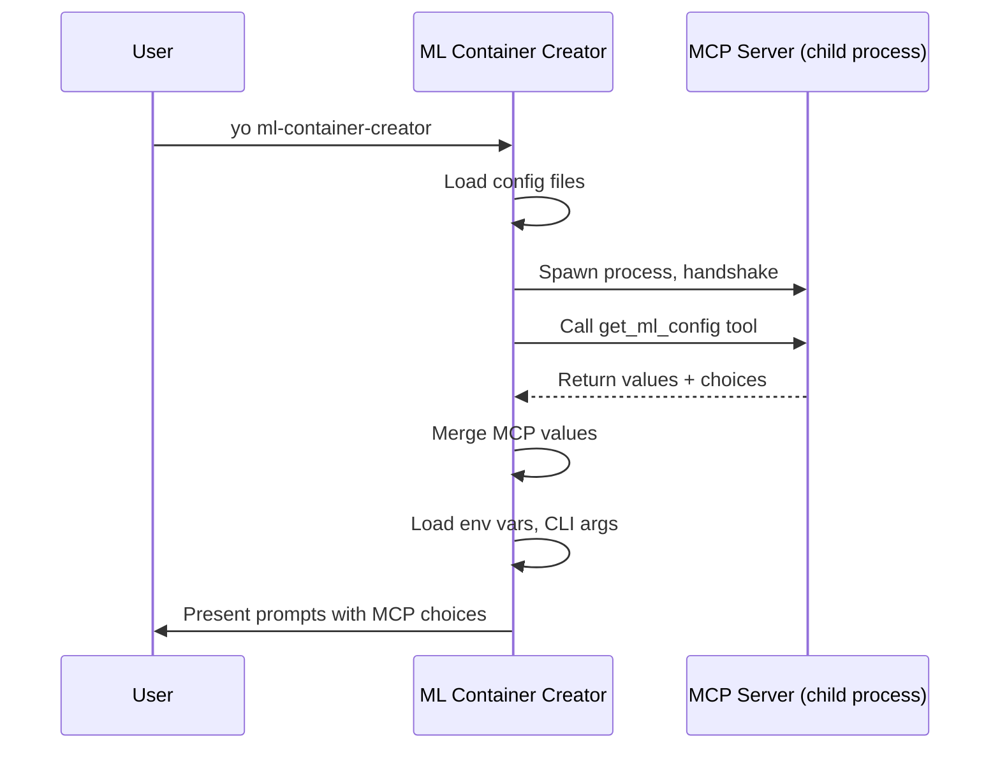

# MCP Configuration

ML Container Creator supports [Model Context Protocol](https://modelcontextprotocol.io/) (MCP) as a configuration source. MCP servers provide configuration values — like recommended instance types or AWS regions — that the generator merges into its configuration chain during project generation.

## How It Works

MCP is an open protocol that standardizes how applications communicate with external tool servers. In ML Container Creator, MCP serves as a **configuration provider protocol**: the generator spawns MCP servers as child processes, queries them for parameter values over stdio, and merges the results into the configuration.



!!! info "MCP Without an LLM"
    The standard MCP pattern places an LLM between the user and the tool servers, with the LLM deciding which tools to call and reasoning over results. ML Container Creator uses MCP differently — as a **standardized tool protocol** for configuration providers. The generator programmatically queries MCP servers and merges results without an LLM in the loop. This is a deliberate design choice: configuration loading should be deterministic and fast, not dependent on model inference.

    The servers themselves are fully MCP-compliant. Any LLM-backed MCP client (Claude, Kiro, or your own) can also connect to these servers and reason over the results.

## Configuration Precedence

MCP sits between config files and environment variables in the precedence chain:

| Priority | Source |
|----------|--------|
| 1 (highest) | CLI Options |
| 2 | CLI Arguments |
| 3 | Environment Variables |
| **4** | **MCP Servers** |
| 5 | CLI Config File |
| 6 | Custom Config File |
| 7 | Package.json |
| 8 (lowest) | Generator Defaults |

Environment variables, CLI arguments, and CLI options always override MCP-provided values. MCP overrides config files and defaults.

## Eligible Parameters

Not all parameters can be set via MCP. Only parameters with **unbounded value spaces** — where valid values form an open-ended set — are eligible:

| Parameter | MCP Eligible | Reason |
|-----------|:---:|--------|
| `instanceType` | ✅ | Open-ended set of SageMaker instance types |
| `awsRegion` | ✅ | AWS adds new regions over time |
| `awsRoleArn` | ✅ | Arbitrary IAM role ARNs |
| `framework` | ❌ | Fixed set: sklearn, xgboost, tensorflow, transformers |
| `modelServer` | ❌ | Fixed set: flask, fastapi, vllm, sglang, etc. |
| All others | ❌ | Bounded value spaces |

MCP servers can return values for any parameter, but the generator silently discards values for ineligible (bounded) parameters.

## Managing MCP Servers

### Quick Start — Initialize All Bundled Servers

The fastest way to set up MCP is to register all bundled servers at once:

```bash
yo ml-container-creator mcp init
```

This creates `config/mcp.json` with every bundled server pre-configured. Existing servers are preserved (not overwritten). Run this after cloning the repo or whenever you need to recreate the config file.

### Add a Server

Register an MCP server in your `config/mcp.json`:

```bash
yo ml-container-creator mcp add team-config -- node path/to/server.js
```

With environment variables and options:

```bash
yo ml-container-creator mcp add team-config -- npx -y @corp/mcp-config \
  -e TEAM_ID=ml-platform \
  --tool-name get_approved_config \
  --limit 5
```

### Add a Bundled Server

The generator ships with first-party MCP servers in the `servers/` directory:

```bash
yo ml-container-creator mcp add instance-recommender --bundled
```

Dependencies are installed automatically on first use.

### List Servers

```bash
# List configured servers
yo ml-container-creator mcp list

# List available bundled servers
yo ml-container-creator mcp list --bundled
```

### Inspect a Server

```bash
yo ml-container-creator mcp get team-config
```

### Remove a Server

```bash
yo ml-container-creator mcp remove team-config
```

!!! note "Registration vs. Execution"
    The `mcp add` command only **registers** a server in your config file. The server is actually **spawned and queried** later, when you run `yo ml-container-creator` to generate a project. This separation means you can configure servers without them needing to be available at registration time.

## Config File Format

MCP servers are configured under the `mcpServers` key in `config/mcp.json`:

```json
{
  "framework": "sklearn",
  "modelServer": "flask",
  "mcpServers": {
    "team-config": {
      "command": "node",
      "args": ["servers/instance-recommender/index.js"],
      "env": { "TEAM_ID": "ml-platform" },
      "toolName": "get_ml_config",
      "limit": 5
    }
  }
}
```

| Field | Type | Required | Default | Description |
|-------|------|:---:|---------|-------------|
| `command` | string | ✅ | — | Executable to spawn |
| `args` | string[] | — | `[]` | Command-line arguments |
| `env` | object | — | `{}` | Additional environment variables |
| `toolName` | string | — | `get_ml_config` | MCP tool to call |
| `limit` | integer | — | `10` | Max choices per parameter |

When multiple servers are configured, they are queried in order. Later servers take precedence over earlier ones for conflicting values.

## Bundled Servers

### instance-recommender

Recommends SageMaker instance types based on the current framework. Traditional ML frameworks (sklearn, xgboost, tensorflow) get CPU instance suggestions; transformer frameworks get GPU instances.

```bash
yo ml-container-creator mcp add instance-recommender --bundled
```

With Bedrock-powered smart recommendations:

```bash
yo ml-container-creator mcp add instance-recommender --bundled \
  -e BEDROCK_SMART=true
```

### region-picker

Suggests AWS regions based on a search term. Set the `REGION_SEARCH` environment variable to filter by region code or location name (e.g., "europe", "tokyo", "us-west"). Without a search term, returns popular SageMaker regions.

```bash
# Filter for European regions
yo ml-container-creator mcp add region-picker --bundled -e REGION_SEARCH=europe

# Popular regions (no filter)
yo ml-container-creator mcp add region-picker --bundled
```

With Bedrock-powered smart recommendations:

```bash
yo ml-container-creator mcp add region-picker --bundled \
  -e REGION_SEARCH=europe \
  -e BEDROCK_SMART=true
```

## Smart Mode (Amazon Bedrock)

Both bundled servers support an optional smart mode that queries Amazon Bedrock for context-aware recommendations instead of returning static lists. When enabled, the server sends the current ML configuration context to a Bedrock model and uses the LLM's response to inform its recommendations.

Smart mode is opt-in. Set `BEDROCK_SMART=true` in the server's environment to enable it. If the Bedrock call fails for any reason (missing credentials, model not available, rate limit, timeout), the server falls back to its static recommendations with a descriptive log message.

### Configuration

| Environment Variable | Default | Description |
|---------------------|---------|-------------|
| `BEDROCK_SMART` | `false` | Set to `true` to enable Bedrock-powered recommendations |
| `BEDROCK_MODEL` | `global.anthropic.claude-sonnet-4-20250514-v1:0` | Bedrock model ID to use |
| `BEDROCK_REGION` | `us-east-1` | AWS region for Bedrock API calls |

The default model uses Anthropic Claude Sonnet 4 via the global cross-region inference profile, which routes requests to the nearest available region for best throughput. You can override this with any Bedrock model ID that supports the Messages API.

### Prerequisites

- AWS credentials configured (via environment, profile, or IAM role)
- Access to the specified Bedrock model enabled in your account
- The `@aws-sdk/client-bedrock-runtime` package installed (included in bundled server dependencies)

### IAM Permissions

The calling identity needs `bedrock:InvokeModel` permission on the inference profile:

```json
{
    "Effect": "Allow",
    "Action": "bedrock:InvokeModel",
    "Resource": "arn:aws:bedrock:*:*:inference-profile/global.anthropic.claude-sonnet-4-20250514-v1:0"
}
```

### Example

```bash
# Add instance-recommender with smart mode and a custom model
yo ml-container-creator mcp add instance-recommender --bundled \
  -e BEDROCK_SMART=true \
  -e BEDROCK_MODEL=us.anthropic.claude-sonnet-4-20250514-v1:0 \
  -e BEDROCK_REGION=us-west-2
```

!!! tip "Cost"
    Each `yo ml-container-creator` run with smart mode enabled makes one Bedrock API call per server. With Claude Sonnet 4, this typically costs a fraction of a cent per invocation.

## Graceful Degradation

MCP is entirely optional. If a server is not configured, unreachable, times out (default 10s), or returns errors, the generator logs a warning and continues without MCP values. Prompts fall back to their default choices with a "Custom (enter manually)" option.

This means MCP enhances the experience when available but never blocks project generation.

## Writing a Custom MCP Server

Any process that speaks the MCP protocol over stdio can serve as a configuration provider. Your server needs to:

1. Handle the MCP initialize handshake
2. Register a tool (default name: `get_ml_config`)
3. Accept `{ parameters, limit, context }` as tool input
4. Return `{ values, choices }` as a JSON text response

### Tool Input

```json
{
  "parameters": ["instanceType", "awsRoleArn", "awsRegion"],
  "limit": 10,
  "context": {
    "framework": "transformers",
    "modelServer": "vllm"
  }
}
```

- `parameters` — which unbounded parameter names the generator is requesting
- `limit` — maximum number of choices to return per parameter
- `context` — current configuration state (framework, model server, etc.) for informed recommendations

### Tool Response

```json
{
  "values": {
    "instanceType": "ml.g5.xlarge"
  },
  "choices": {
    "instanceType": [
      "ml.g5.xlarge",
      "ml.g5.2xlarge",
      "ml.g4dn.xlarge"
    ]
  }
}
```

- `values` — recommended default value per parameter (merged into config)
- `choices` — list of options per parameter (shown during prompting)

Both fields are optional. A server may return only values, only choices, or both.

### Example Server

```javascript
import { McpServer } from '@modelcontextprotocol/sdk/server/mcp.js'
import { StdioServerTransport } from '@modelcontextprotocol/sdk/server/stdio.js'
import { z } from 'zod'

const server = new McpServer({ name: 'my-config-server', version: '1.0.0' })

server.tool(
    'get_ml_config',
    'Returns ML configuration values',
    {
        parameters: z.array(z.string()),
        limit: z.number().int().positive().default(10),
        context: z.record(z.string(), z.any()).optional()
    },
    async ({ parameters, limit, context }) => {
        const values = {}
        const choices = {}

        // Your logic here — query a database, call an API, read a file, etc.

        return {
            content: [{
                type: 'text',
                text: JSON.stringify({ values, choices })
            }]
        }
    }
)

const transport = new StdioServerTransport()
await server.connect(transport)
```

Register it:

```bash
yo ml-container-creator mcp add my-server -- node path/to/my-server.js
```

See `servers/README.md` for the full directory structure and license requirements for bundled servers.
